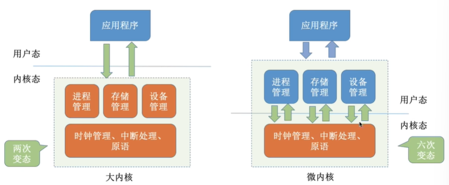
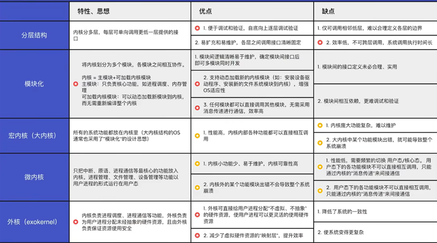
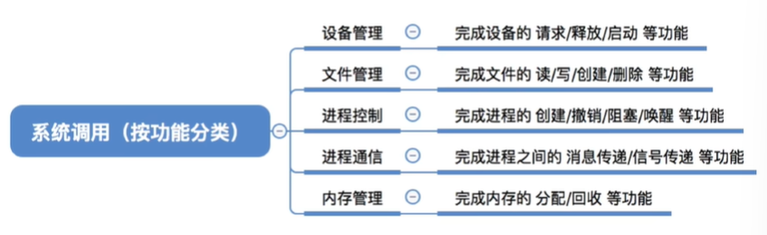
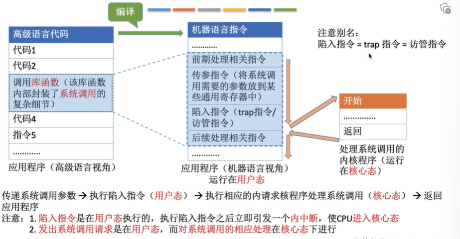
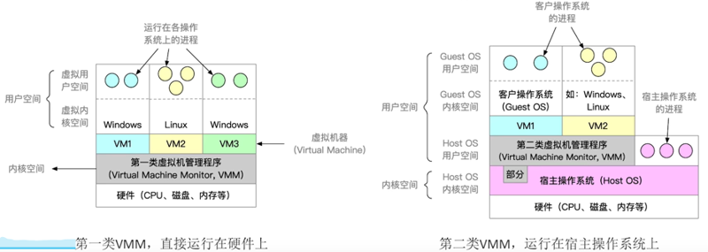
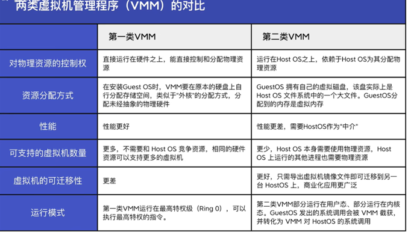

# 操作系统
## 1.1_1 操作系统的概念. 功能和目标
**概念：**操作系统（OperatingSystem, OS）是指控制和**管理**整个计算机系统的**硬件和软件**资源（操作系统是系统资源的管理者），并合理地组织调度计算机的工作和资源的分配；**以提供给用户和其他软件方便的接口和环境**（向上提供方便易用的服务）；他是计算机系统中最基本的**系统软件**（是最接近硬件的一层软件）。
**操作系统的功能和目标--向上层提供方便易用的服务**
* 对于用户提供的功能
    * 命令接口（联机命令接口|脱机命令接口）
    * 程序接口
    * GUI（图形用户界面win|ios|andrio）
* 给软件/程序员提供
    * 程序接口（即系统调用，用户通过程序间接使用）
    * 方便用户使用

联机命令接口|脱机命令接口区别在于说一句做一句还是说一堆做一堆

## 1.1_2 操作系统的特征
**并发|并行**
* 并发：多个事件交替发生（宏观同时发生. 微观交替进行）
* 并行：多个事件同时发生

**共享**
两种资源共享方式
* 互斥共享方式：一个时间段内只允许一个进程访问该资源
* 同时共享方式：允许一个时间段内由多个进程“同时”对它们进行访问

**并发和共享的关系**
* 并发性指计算机系统中同时存在着多个运行着的程序。
* 共享性是指系统中的资源可供内存中多个并发执行的进程共同使用。

**虚拟**
概念：把一个物理上的实体变为若干个逻辑上的对应物
* 空分复用计数（如虚拟存储器技术）
* 时分复用计数（如虚拟处理器）（微观上处理机在各个微笑的时间段内交替着为各个进程服务）

对于时分复用计数，显然，如果失去了并发性，则一个时间段内系统中只需运行一道程序，那么久失去了实现虚拟性的意义了。因此**没有并发性，就谈不上虚拟性。**

**异步**
* 概念：在多道程序环境下，允许多个程序并发执行，但由于资源有限，进程的执行不是一贯到底的，而是走走停停的，以不可预知的速度向前推进。**只有系统拥有并发性，才有可能导致异步性。**

## 1.1_3 操作系统的发展与分类
**OS的发展与分类**
* 手工操作阶段
    * 纸带机（用户独占全机. 人机速度矛盾）
* 批处理阶段——单道
    * 单道批处理系统（外围机——磁带）
    * 多道批处理系统（操作系统开始出现）
* 分时操作系统
    * 轮流处理作业
    * 不能处理紧急任务
* 实时操作系统
    * 优先处理紧急任务
    * 硬实时系统：必须在严格的时间内完成处理
    * 软实时系统：可以偶尔犯错
* 网络操作系统
* 分布式操作系统
* 个人计算机操作系统

## 1.1_4 操作系统的运行机制与体系结构
**OS的运行机制和体系结构**
* 运行机制
* 两种指令
    * 特权指令（如加法指令，减法指令）
    * 非特权指令（如内存清理指令）
* 两种处理器状态
    * 内核态（核心态，管态）（运行内核程序，可以执行特权指令）
    * 用户态（目态）（运行应用程序，只能执行非特权指令）
* 两种程序
    * 内核程序(运行在内核态 )
    * 应用程序
* 操作系统内核
    * 时钟管理（实现计时功能）
    * 中断处理
    * 原语（程序运行具有原子性，不可中断）
* 对系统资源进行管理的功能
    * 进程管理
    * 存储器管理
    * 设备管理
* 操作系统的体系结构
    * 大内核（宏内核/单内核）（将操作系统的主要功能模块都作为系统内核，运行在内核态）
    * 微内核（只把最基本的功能保留在内核）
    * 
    * 注：变态->更正规的说法是CPU状态的转换
    * 分层结构
    * 模块化
    * 外核
    * 
* 内核态、用户态的切换
    * 内核态->用户态：执行一条特权指令--修改PSW的标志为“用户态”，这个动作意味着操作系统将主动让出CPU使用权
    * 用户态—>内核态：由“中断”引发，硬件自动完成变态过程，触发中断信号意味着操作系统将强行夺回CPU的使用权。（除了非法使用特权指令之外，还有很多事件会触发中断信号。一个共性是，但凡需要操作系统介入的地方，都会触发中断信号）

## 1.1_5 中断和异常
* 中断机制的诞生
    * 操作系统介入，开展管理工作
    * “用户态—>核心态”是通过中断实现的。**并且中断是唯一途径**
* 中断的分类

## 1.1_6 系统调用
概念：应用程序通过系统调用请求操作系统的服务。保证系统的稳定性和安全性，防止用户进行非法操作。
系统调用按功能分类：

系统调用的过程：

凡是共享资源有关的操作、会直接影响到其他进程的操作，就一定需要操作系统介入，就需要通过系统调用来实现。

系统调用和库函数的区别：
* 系统调用是操作系统向上层提供的接口
* 有的库函数是对系统调用的进一步封装
* 当今编写的应用程序大多是通过高级语言提供的库函数间接地进行系统调用

## 1.1_7 虚拟机
概念：虚拟机使用虚拟化技术，将一台物理机器虚拟化为多台虚拟机器(VirtualMachine,VM)，每个虚拟机器都可以独立运行一个操作系统。
同义术语：虚拟机管理程序/虚拟机监控程序/VirtualMachineMonitor/Hypervisor

