## 2.1_1 进程的定义. 组成. 组织方式. 特征
定义：
进程实体（进程映像）的组成：PCB（进程存在唯一的标志），程序段，数据段。进程是动态的，进程实体是静态的。
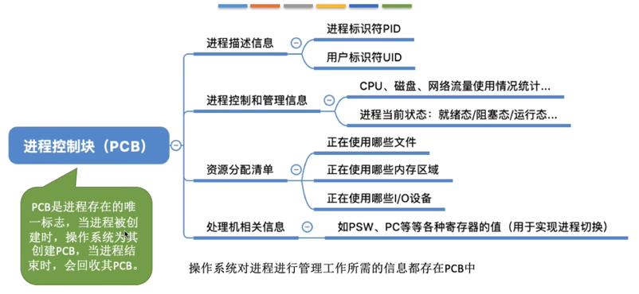
组织方式：链接方式，指针指向不同的队列；索引方式，索引表
进程的特征：动态性. 并发性. 独立性. 异步性. 结构性
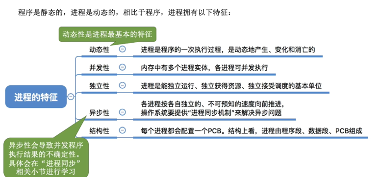

## 2.1_2 进程的状态与转换
状态：
* 运行状态：占有CPU，并在CPU上运行，单核只能运行一个进程（双核两个）（CPU√，其它资源√）
* 就绪状态：已经具备运行条件，但是没有空闲的CPU，暂时不能运行（CPUX，其它资源√）
* 阻塞状态：等待某个事件的发生，暂时不能运行（CPUX，其它资源X）
* 创建状态：创建PCB，程序段，数据段
* 终止状态：回收内存，程序段，数据段，撤销PCB

进程状态间的转换
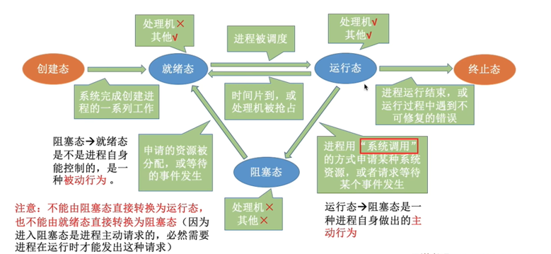

## 2.1_3 进程控制
**基本概念：**
什么是进程控制？
答：实现各种进程状态转换。

如何实现进程控制？
答：用“原语”实现。因为源于的执行具有“原子性”，一气呵成。如果不能“一气呵成”，就有可能导致操作系统中的某些关键数据结构信息不统一的情况，这会影响操作系统进行别的管理工作。

如何实现原语的“原子性”：
答：利用开关中断指令。

原语做的事情：
1. 更新PCB中的信息
2. 将PCB插入合适的队列
3. 分配/回收资源

**进程控制相关的原语：**
1. 进程的创建：
创建原语：申请空白PCB. 为新进程分配所需资源. 初始化PCB. 将PCB插入就绪队列
引起进程创建的事件：用户登录. 作业调度. 提供服务. 应用请求
2. 进程的终止：
撤销原语
引起进程中止的事件：正常结束. 异常结束. 外界干预
3. 进程的阻塞：
阻塞原语：运行态->阻塞态
引起进程阻塞的事件：需要等待系统分配某种资源. 需要等待相互合作的其他进程完成工作
4. 进程的唤醒：
唤醒原语：阻塞态->就绪态
引起进程唤醒的事件：等待的事件发生
5. 进程的切换
切换原语
引起进程切换的事件：当前进程事件片到. 有更高优先级的进程到达. 当前进程主动阻塞. 当前进程终止

## 2.1_4 进程通信
1. 共享存储   （分配共享空间，且互斥（P. V操作））
* 基于数据结构的共享：固定分配（比如共享空间里只能放一个长度为10的数组，速度慢，限制多，低级通信）
* 基于存储区的共享：划分存储区（操作系统在内存中划出一块共享存储区，数据的形式、存放位置都用通信进程控制，而不是操作系统，速度快，高级通信）

2. 消息传递
消息：消息头. 消息体
直接通信方式（直接挂载消息）
间接通信方式（间接利用信箱发送消息）

3. 管道通信（pipe）
* 只能半双工通信，某一时间段内只能实现单向的传输。如果实现双向同时通信，则需要设置两个管道。
* 互斥（没写满，不能读，反之同理）
* 管道中的数据一旦被读出，就彻底消失。为此有两种解决方案：1、一个管道允许多个写程序，一个读进程；2、允许有多个写程序，多个读进程，但系统会让各个读进程轮流从管道中读数据。

4. 共享文件

## 2.1_5 线程概念和多线程模型
**什么是线程，为什么要引入线程？**
1. 传统的进程是程序执行流的最小单位。
2. 引入线程后，线程成为了程序执行流的最小单位。
3. 线程：轻量级的进程。它是基本的CPU执行单元，也是程序执行流的最小单位。
4. 引入线程后，进一步提升了系统的并发度。

**引入线程机制后，有什么变化？**
1. 资源分配. 调度：
* 传统进程机制中，进程是资源分配. 调度的基本单位。
* 引入线程后，进程是资源分配的基本单位，线程是调度的基本单位。
2. 并发性：
* 传统进程机制中，只能进程间并发。
* 引入线程后，各线程间也能并发，提升了并发度。
3. 系统开销
* 传统进程间并发，常常需要切换进程的运行环境，系统开销大。
* 线程间并发，如果是同一进程内的线程切换，则不需要切换进程环境，系统开销小。
* 引入线程后，并发所带来的系统开销减小


1. 线程有哪些重要的属性
* 线程是处理机调度的基本单位
* 多CPU计算机中，各个线程可占用不同的CPU
* 每个线程都有一个线程ID. 线程控制块（TCB）
* 线程也有就绪. 阻塞. 运行三种基本状态
* 线程几乎不拥有系统资源
* 同一进程的不同线程间共享进程的资源
* 由于共享内存地址空间，统一进程中的线程间通信甚至无需系统干预
* 同一进程中的线程切换，不会引起进程切换
* 不同进程中的线程切换，会引起进程切换
* 切换同进程内的线程，系统开销很小
* 切换进程，系统开销较大
2. 线程的实现方式
**用户级线程（ULT）：**
* 用户级线程由应用程序通过线程库实现，所有的**线程管理工作**都由**应用程序负责**（包括线程切换）
* 用户级线程中，线程切换可以在用户态下即可完成，无需操作系统的干预。
* 在用户看来，是多个线程。但是在操作系统内核看来，并意识不到线程的存在。“**用户级线程**”就是“**从用户的视角看能看到的线程**”
* 优点：用户级线程的切换在用户空间即可完成，不需要切换到核心态，线程管理的系统开销小，效率高。
* 缺点：当一个用户级线程呗堵塞后，整个进程都会被堵塞，并发度不高。多个线程不可在多核处理机上并行运行。
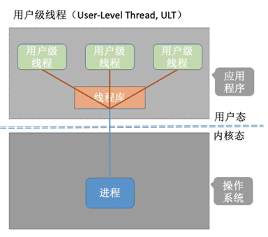

**内核级线程（KLT，又称“内核支持的线程”）：**
* **内核级线程的管理工作**由**操作系统内核**完成。
* 线程调度、切换等工作都由内核负责，因此**内核级线程的切换**必然需要在**核心态**下才能完成。
* 操作系统会为每个内核级线程建立相应的TCB（线程控制块）通过TCB对线程进行管理。“**内核级线程**”就是“**从操作系统内核视角看能看到的线程**”。
* 优点：当一个线程被堵塞后，别的线程还可以继续执行，并发能力强。多线程可在多核处理机上并行执行。
* 缺点：一个用户进程会占用多个内核级线程，线程切换由操作系统内核完成，需要切换到核心态，因此线程管理的成本高，开销大。
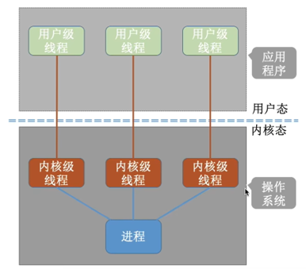

**n个ULT可以映射到m个KLT上（n>=m）**
**内核级线程才是处理机分配的单位**

1. 多线程模型
* 多对一模型
n个ULT映射到1个KLT
优点：开销小，效率高
缺点：容易阻塞，并发度不高
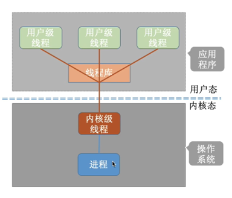
* 一对一模型
n个ULT映射到n个KLT
优点：并发能力很强。一个用户级线程映射到一个内核级线程。
缺点：占用成本高，开销大
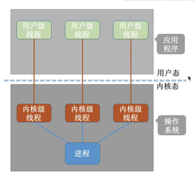
* 多对多模型
n个ULT映射到m个KLT上（n>=m）
克服了多对一模型并发度不高的缺点(一个阻塞全体阻塞)，又克服了一对一模型中一个用户进程占用太多内核级线程，开销太大的缺点。
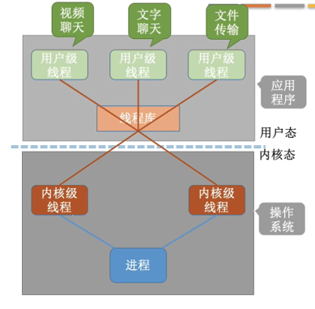

## 2.2_1 处理机调度的概念. 层次
**基本概念**
通常进程数量大于处理机数量，所以要按照一定的算法选择一个进程，并将处理机分配给它运行，以实现进程的并发执行

**三个层次:**
* 高级调度（作业调度）
辅助外存与内存之间的调度，作业调入时会建立相应的PCB，作业调出时才撤销PCB，调入可由操作系统决定，调出由作业运行结束才调出
* 中级调度（内存调度）
将暂时不用的进程放到外存（PCB不外放），提高内存利用率和系统吞吐量，进程状态为挂起状态，形成挂起队列
* 低级调度（进程调度）
按照某种策略从就绪队列中选取一个进程，将处理机分配给它。
进程调度是操作系统中**最基本的一种调度**，在一般的操作系统中都必须配置进程调度。进程调度的频率很高，一般几十毫秒一次。

**三层调度的联系. 对比**
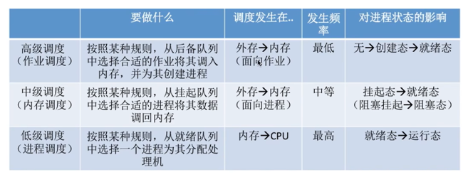
**七状态模型**
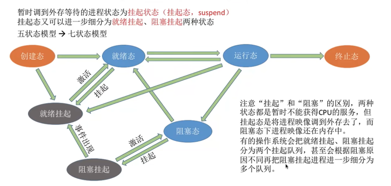
五状态前面学了，挂起分为就绪挂起. 阻塞挂起


## 2.2_2 进程调度的时机. 切换与过程调度方式
1. 时机
**什么时候需要进程调度？**
* **当前运行的进程主动放弃处理机**（进程正常终止. 运行过程中发生异常而终止. 进程主动请求阻塞）
* **当前运行的进程被动放弃处理机**（分给进程的时间片用完. 有更紧急的事需要处理（如I/O中断）. 有更高优先级的进程进入就绪队列）

**什么时候不能进行进程调度？**
* 在处理中断的过程中
* 在操作系统内核程序临界区中
    * 临界资源：一个时段段内各进程互斥地访问临界资源
    * 临界区：访问临界资源的那段代码
    * 内核程序临界区会访问就绪队列，导致其上锁
* 在原子操作过程中（原语）

2. 切换与过程
“狭义的进程调度”与“进程切换”的区别
* 狭义的进程调度：从就绪队列中选择一个要运行的进程
* 进程切换：指一个进程让出处理机，由另一个进程占用处理机的过程。
* 广义的进程调度：狭义的进程调度+进程切换

进程切换的过程需要做什么？
* 对原来运行进程各种数据的保存
* 对新的进程各种数据的恢复

注：**进程切换是有代价的**，因此如果过于频繁的进行进程调度、切换，必然会使整个系统的效率降低，使系统大部分时间都花在了进程切换上，而真正用于执行进程的时间减少。

3. 方式
非剥夺调度方式（非抢占式）
* 只允许进程主动放弃处理机
剥夺调度方式（抢占式）
* 进程被动放弃，可以优先处理紧急任务，适合分时操作系统. 实时操作系统

4. 调度器/调度程序(scheduler)
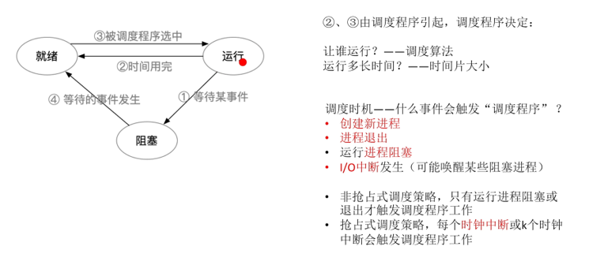

5. 闲逛进程
* 闲逛进程是调度程序永远的备胎，没有其他就绪进程时，运行闲逛进程(idle)
* 闲逛进程的特性
  * 优先级最低
  * 可以是0地址指令，占一个完整的指令周期(指令周期末尾例行检查中断)
  * 能耗低

## 2.2_3 调度算法的评价指标
1. CPU利用率=CPU忙碌的时间/总时间
2. 系统吞吐量=总共完成了多少道作业/总共花了多少时间
3. 周转时间
* 周转时间（作业完成时间-作业提交时间）. 平均周转时间（各作业周转时间之和/作业数）
* 带权周转时间（作业周转时间/作业实际运行的时间）. 平均带权周转时间（各作业带权周转时间之和/作业数）
1. 等待时间
进程或作业等待处理机状态时间的和
对于进程来说，等待时间就是指进程建立后等待被服务的时间之和，在等待I/O完成的期间其实进程也是在被服务的，所以不计入等待时间。
对于作业来说，不仅要考虑**建立进程的等待时间，还要加上作业在外存后备队列中的等待的时间。**
1. 响应时间
从用户提交请求到首次产生响应所用的时间

## 2.2_4 FCFS. SJF. HRRN调度算法
1. 先来先服务（FCFS）
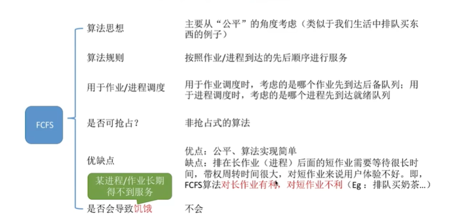

2. 短作业优先（SJF，shortest job first）
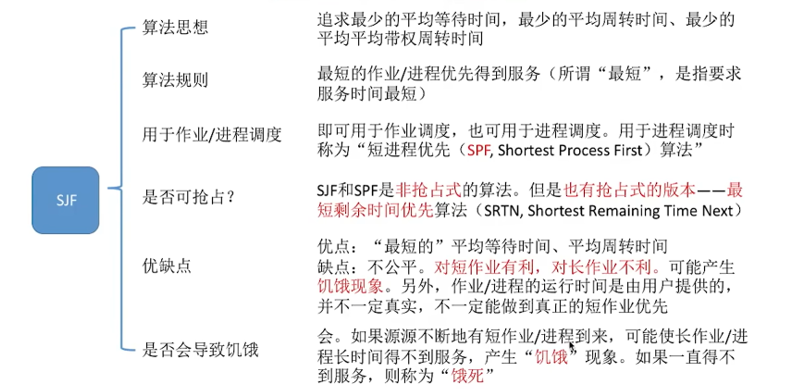
**如果题目未特别说明，所提到的"短作业/进程优先算法"默认是非抢占式的**

3. 高响应比优先（HRRN）
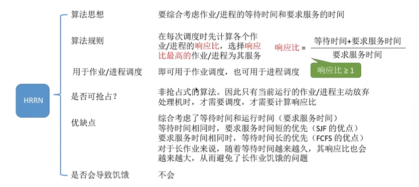

## 2.2_5 时间片轮转. 优先级调度. 多级反馈队列（适合交互式系统）
1. 时间片轮转算法（RR, Round-Robin）
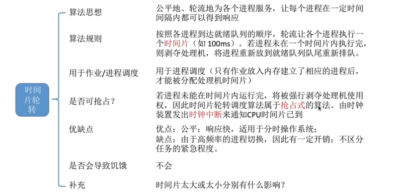

2. 优先级调度算法
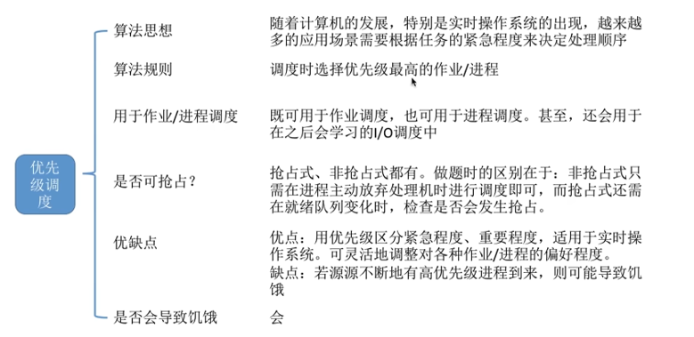

3. 多级反馈队列调度算法
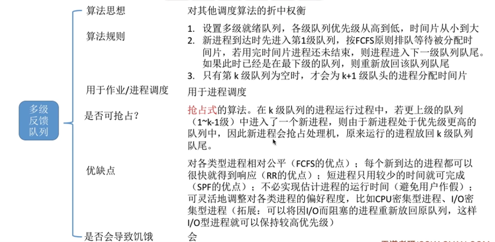

4. 多级队列调度算法
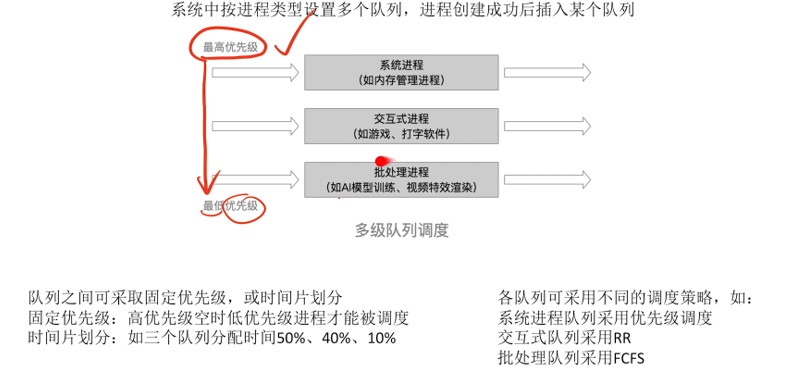

## 2.3_1 进程同步. 进程互斥
1. 进程同步
指为了完成某种任务而建立的两个或多个进程，这些进程因为需要在某些位置上协调他们的工作次序而产生的制约关系。进程间的直接制约关系就是源于它们之间的相互合作。

2. 进程互斥

把一个时间段内只允许一个进程使用的资源称为临界资源。
对临界资源的互斥访问，可以在逻辑上分为四个部分：
```
do{
  entry section;  //进入区  对访问的资源检查或进行上锁
  critical section; //临界区(段) 访问临界资源的那部分代码
  exit section;   //退出区  负责解锁
  remainder section; //剩余区  其它处理
} while(true)
```
1. 空闲让进。 临界区空闲时，可以允许一个请求进入临界区的进程立即进入临界区。
2. 忙则等待。 当已有进程进入临界区时，其他试图进入临界区的进程必须等待。
3. 有限等待。 对请求访问的进程，应保证能在有限时间内进入临界区（保证不会饥饿）
4. 让权等待。 当进程不能进入临界区时，应立即释放处理机，防止进程忙等待。

## 2.3_2 进程互斥的软件实现方法
1. 单标志法
两个进程在访问完临界区后会把使用临界区的权限教给另一个进程。也就是说每个进程进入临界区的权限只能被另一个进程赋予
```
A进程
while (turn != A);
critical section 临界区
turn = B
remainder section 剩余区

B进程
while (turn != B);
critical section
turn = A
remainder section
```
>可以实现互斥
缺点:当有一个进程不再进入临界区，便不能修改公共变量的turn，来标识另外一个进程可以进入临界区。因此另外一个进程将永久不能进入临界区，违背“空则让进”的原则

2. 双标志先检查 
算法思想:设置一个bool数组flag[]来标记自己是否想要进入临界区的意愿

```
bool flag[2] = {false, false}; 
flag[A]==true 表示A正在使用临界区
flag[B]==true 表示B正在使用临界区

A进程
while (flag[B]==true); 当B在临界区便一直循环检查 (1) 
flag[A]=true; 表示A自己在临界区域中              (3)
critical section
flag[A]=false; 表示A自己退出临界区
remainder section


B进程
while (flag[A]==true); 当A在临界区便一直循环检查 (2) 
flag[B]=true; 表示B自己在临界区域中              (4)
critical section
flag[B]=false; 表示B自己退出临界区
remainder section
```

>优点：不需要交替进入临界区，可以连续使用
缺点：两个进程可能会同时进入临界区，初始状态，A与B进程均不在临界区内，所以flag[A]==flag[B]=false，此时按照CPU若按照，(1)(2)(3)(4)的顺序进行执行，A，B进程都能检查到对方不在临界区中，然后进入临界区，分别置自己的值为true，但此时临界区中有两个互斥的进程，违背“忙则等待”的原则。出现这种问题的原因是：检查对方的状态和置自己的状态这两步操作之间存在漏洞，不是原子的。

3. 双标志后检查
算法思想:设置一个bool数组flag[]来标记自己是否想要进入临界区的意愿,不过是先上锁后检查

```
flag[2] = {false, false};
A进程
flag[A]=true;  (1)
while (flag[B]==true); (3)
critical section
flag[A]=false;
remainder section;


B进程
flag[B]=true; (2)
while (flag[A]==true); (4) 
critical section
flag[B]=false;
remainder section;
```
>优点：双标志后检查法解决了在双标志先检查法中出现的违背“忙则等待”原则的问题。
缺点：可能会造成饥饿现象，违背“有限等待”的原则。
原因：CPU可能是按照(1)(2)(3)(4)的顺序执行程序，此时A与B进程均将自己的状态修改为进入临界区，此时执行(3)(4)，A,B进程均检查到对方在临界区中，最终造成饥饿，违背“优先等待”的原则。

会饥饿

4. Peterson 算法
主动让对方先使用处理器

```
A进程
flag[2] = {false, false};

flag[A]=true;我有占有权 turn=B;你先用，不要客气
while (flag[B]==true && turn==B);
critical section
flag[A]=false;
remainder section

B进程
flag[2] = {false, false};

flag[B]=true;我有占有权 turn=A;你先用，不要客气
while (flag[A]==true && turn==A);
critical section
flag[B]=false;
remainder section
```
>优点：peterson算法完美的遵守了空则让进，有限等待，忙则等待的原则。但是，当A或B进程其一在临界区中，而此时处理机调度B或A时，while循环进行了忙轮询，浪费消耗处理机时间，违背“让权等待”的原则。

## 2.3_3 进程互斥的硬件实现方法
1. 中断屏蔽方法

关中断（不允许进程中断）
临界区
开中断

简单. 高效
多处理机，可能会同时访问临界资源
使用OS内核进程

2. TestAndSet（TSL指令）

TSL是用硬件实现的，上锁. 检查一气呵成
C语言描述逻辑：

```
//true表示已经上锁
bool TestAndSet(bool *lock){
  bool key;
  old=*lock;
  *lock=true;
  return key;
}
​
//以下是使用TSL指令实现互斥的算法逻辑
while(TestAndSet (&lock));//上锁并检查
临界区代码段
lock=false; //解锁
```
​
优点:实现简单，无需像软件实现方法那样严格检查是否会有逻辑漏洞;适用于多处理机环境
缺点:不满足“让权等待”原则，暂时无法进入临界区的进程会占用CPU并循环执行TSL指令，从而导致“忙等”。

3. Swap指令

别称：Exchange指令. XCHG指令
>Swap指令的管理思想与日常生活中互斥进入房间的某种管理机制类似，首先一把锁头配n把钥匙，每一人一把钥匙，房门外有一个守门的老头，又聋又哑，只能完成交换手中一样物品(锁头或钥匙)的工作，开始守门老头手上只有一把锁头，想进入房间者先用自己的钥匙与守门老头交换，如果换出的是锁头，则请求进入者就可以拿着锁头进入房间然后反锁，保证自己一个人在房间内，这样后来者想进入房间也要用自己的钥匙跟守门老头手中的物品交换，但此时换出来的只能是钥匙，拿不到锁头就只能在门外等候，直到房间内的那个人出来，用锁头跟老头交换回钥匙为止，后来者才能换到锁头，进入房间…

Swap指令是用硬件实现的

```
//true表示已经上锁
void Swap(bool *a,bool *b){
  bool temp;
  temp=*a;
  *a=*b;
  *b=temp;
}
​
//以下是使用Swap指令实现互斥的算法逻辑
bool key=true;
while(key=true)
  Swap(&lock,&key);
临界区代码段
lock=false; //解锁
//剩余代码段

```
设置lock为全局变量，初值为FALSE，key为局部变量。当lock == FALSE，调用swap，key == FALSE，进入临界区，将lock重置为FALSE。当lock == TRUE，调用swap，key == TRUE，继续进入内部循环。

利用swap硬件指令可以简单实现互斥，当资源忙碌时（lock==TRUE），其他访问进程需不断测试，不符合同步机制规则中“让权等待”，造成处理机时间的浪费，同时也很难将他们用于复杂的进程同步问题。

## 2.3_4 信号量机制
**信号量**：信号量是一种变量，表示系统中某种资源的数量

一对原语：wait（S）原语和signal（S）原语，分别简称P（S）. V（S）

1. 整形信号量

用一个整数表示系统资源的变量，用来表示系统中某种资源的数量

```
int S=1;
void wait(int S){ //wait原语，相当于：进入区
  while(S<=0); //如果资源数不够，就意志循环等待
  S=S-1;    //如果资源数够，则占用一个资源
}
​
void signal(int S){//signal原语，相当于“退出区”
  S=S+1;    //使用完资源后，在退出区释放资源
}
```
缺点：可能会出现忙等

2. 记录型信号量

记录型数据结构表示的信号量

```
//记录型信号量的定义
typedef struct{
  int value;
  struct process *L;
} semaphore;
//某进程需要使用资源时，通过wait原语申请
void wait (semaphore S){
  S.value--;
  if(S.value<0){
    block (S.L);//将该进程加入到阻塞队列中
 }
}
//进程使用完资源后，通过signal原语释放
void signal (semaphore S){
  S.value++;
  if(S.valie<=0){
    wakeup(S.L);//唤醒等待序列的一个进程，将其从阻塞态变为就绪态
 }
}
```
除非特别说明，否则默认S为记录型信号量

## 2.3_5 用信号量机制实现进程互斥. 同步. 前驱关系
1. 实现进程互斥
* 分析并发进程的关键活动，划定临界区
* 设置互斥信号量mutex，初值为1
* 在进入区P(mutex)--申请资源
* 在退出区V(mutex)--释放资源

**注：对不同的临界资源需要设置不同的互斥信号量，PV必须成对出现**

2. 实现进程同步
* 分析什么地方需要实现“同步关系”，即必须保证“一前一后”执行两个操作（或两句代码）
* 设置同步信号量S，初始为0
* 在优先级较 「高」 的操作的 「后」 面执行 V 操作，释放资源
* 在优先级较 「低」 的操作的 「前」 面执行 P 操作，申请占用资源


3. 实现进程的前驱关系
* 要为每一对前驱关系各设置一个同步变量
* 在“前操作”之后对相应的同步变量执行V操作
* 在“后操作”之前对相应的同步变量执行P操作


## 2.3_6 生产者-消费者问题
* 只有缓冲区没满时，生产者才能把产品放入缓冲区，否则必须等待
* 只有缓冲区不空时，消费者才能从中取出产品，否则必须等待
* 缓冲区是临界资源，各个进程互斥访问

```
#include <stdio.h>
#include <windows.h>

#define BUFFER_SIZE 10

int buffer[BUFFER_SIZE];
int in = 0;
int out = 0;

HANDLE mutexHandle;
HANDLE emptySemaphore;
HANDLE fullSemaphore;

DWORD WINAPI Producer(LPVOID lpParam) {
    int item;
    while (1) {
        // 生产数据（采用随机数）
        item = rand() % 100;
        // 等待nEmty信号量>0，即还有空位可以填入，如果等到了，则让emptySemaphore -1 代表已占用
        // WaitForSingleObject会在信号量值大于0时让信号量减1
        WaitForSingleObject(emptySemaphore, INFINITE);
        // 等待可以进行操作
        WaitForSingleObject(mutexHandle, INFINITE);
        // 增加数据
        buffer[in] = item;
        in = (in + 1) % BUFFER_SIZE;
        ReleaseMutex(mutexHandle);
        ReleaseSemaphore(fullSemaphore, 1, NULL);
        printf("生产者将数据%d 放入缓冲区\n", item);
    }
    return 0;
}

DWORD WINAPI Consumer(LPVOID lpParam) {
    int item;
    while (1) {
        // 等待fullSemaphore信号量>0，如果等到了，则让fullSemaphore -1 代表已占用
        WaitForSingleObject(fullSemaphore, INFINITE);
        // 等待可以进行操作
        WaitForSingleObject(mutexHandle, INFINITE);
        // 移出数据
        item = buffer[out];
        out = (out + 1) % BUFFER_SIZE;
        ReleaseMutex(mutexHandle);
        ReleaseSemaphore(emptySemaphore, 1, NULL);
        printf("---消费者从缓冲区中取数据%d\n", item);
    }
    return 0;
}

int main() {
    // 创建互斥锁
    mutexHandle = CreateMutex(NULL, FALSE, NULL);
    // 创建空、满信号量
    emptySemaphore = CreateSemaphore(NULL, BUFFER_SIZE, BUFFER_SIZE, NULL);
    fullSemaphore = CreateSemaphore(NULL, 0, BUFFER_SIZE, NULL);
    // 创建消费者，生产者线程
    HANDLE hProducer = CreateThread(NULL, 0, Producer, NULL, 0, NULL);
    HANDLE hConsumer = CreateThread(NULL, 0, Consumer, NULL, 0, NULL);
    // 等待线程结束
    WaitForSingleObject(hProducer, INFINITE);
    WaitForSingleObject(hConsumer, INFINITE);
    // 关闭所有句柄
    CloseHandle(mutexHandle);
    CloseHandle(emptySemaphore);
    CloseHandle(fullSemaphore);
    CloseHandle(hProducer);
    CloseHandle(hConsumer);
    return 0;
}
```

## 2.3_7 多生产者-多消费者模型
在生产-消费者问题中，如果缓冲区大小为1，那么有可能不需要设置互斥信号量就可以实现互斥访问缓冲区

分析同步问题是，应该从“事件”的角度来考虑


## 2.3_8 吸烟者问题
解决“可以让生产多个产品的单生产者”问题提供一个思路；

若一个生产者要生产多种产品（或者说会引发多种前驱事件），那么各个V操作应该放在各自对应的“事件”发生之后的位置


## 2.3_9 读者-写者问题
1. 允许多个读者同时对文件执行读操作

2. 只允许一个写者往文件中写信息

3. 任一写者在完成写操作之前不允许其他读者或写者工作

4. 写者执行写操作前，应让已有的读者和写者全部退出

```
semaphore rw=1;//用于实现对文件的互斥访问。表示当前是否有进程在访问共享文件
int count=0;//记录当前有几个读进程在访问文件
semaphore mutex=1;//用于保证对count变量的互斥访问
semaphore w=1; //用于实现“写优先”
  
writer(){
  while(1){
    P（w）;
    P(rw); //写之前“加锁”
    写文件。。。
    V(rw);//写之后“解锁”
  V(w);
 }
}
​
reader(){
  while(1){
    P(w);
   P(mutex); //各读进程互斥访问count
    if(count==0) 
      P(rw); //第一个读进程的读进程数+1
    count++; //访问文件的读进程数+1
    V(mutex); 
    V(w);
    读文件...
    P(mutex); //各读进程互斥访问count
    count--; //访问文件的读进程数-1
    if(count==0)
      V(rw); //最后一个读进程负责“解锁”
    V(mutex);
 }
}
```

## 2.3_10 哲学家进餐问题
五个人，必须拿左右的筷子才能吃饭

避免死锁发生

解决方案：

1. 可以对哲学家进程施加一些限制条件，比如最多允许四个哲学家同时进餐，这样可以保证至少有一个哲学家是可以拿到左右两只筷子的。

2. 要求奇数号哲学家先拿左边的筷子，然后再拿右边的筷子，而偶数号哲学家刚好相反。用这种方法可以保证如果相邻的两个奇偶号哲学家都想吃饭，那么只会有其中一个可以拿起第一只筷子，另一个会直接阻塞。这就避免了占有一只后再等待另一只的情况。

3. 仅当一个哲学家左右两只筷子都可用时才允许他抓起筷子。

```
semaphore chopstick[5]={1,1,1,1,1};
semaphore mutex = 1; //互斥地取筷子
Pi(){     //i号哲学家的进程
  while(1){
    P(mutex);
    p(chopstick[i]);   //拿右
    p(chopstick[(i+1)%5]);//拿左
    V(mutex);
    吃饭...
    V(chopstick[i]);
    V(chopstick[(i+1)%5]);
    思考...
 }
}
```

## 2.3_11 管程(Moniters，也称为监视器)
**基本介绍**
> &emsp;所谓管程：指的是管理共享变量以及对共享变量的操作过程，让它们支持并发。翻译为 Java 就是管理类的成员变量和成员方法，让这个类是线程安全的。
> &emsp;管程是一种程序结构，结构内的多个子程序（对象或模块）形成的多个工作线程互斥访问共享资源。这些共享资源一般是硬件设备或一群变量。管程实现了在一个时间点，最多只有一个线程在执行管程的某个子程序。与那些通过修改数据结构实现互斥访问的并发程序设计相比，管程实现很大程度上简化了程序设计。 管程提供了一种机制，线程可以临时放弃互斥访问，等待某些条件得到满足后，重新获得执行权恢复它的互斥访问。

**管程互斥与同步实现**
> &emsp;它的思路很简单，将共享变量以及对共享变量的操作统一封装起来。如下图所示，管程 A 将共享变量 data 和相关的操作入队enq()、出队deq() 封装起来。线程 A 和线程 B想访问共享变量 data ，只能通过调用管程提供的 enq() 和 deq() 。当然前提是 enq()、deq() 保证互斥性，只允许一个线程进入管程。是不是很有面向对象的感觉。
> 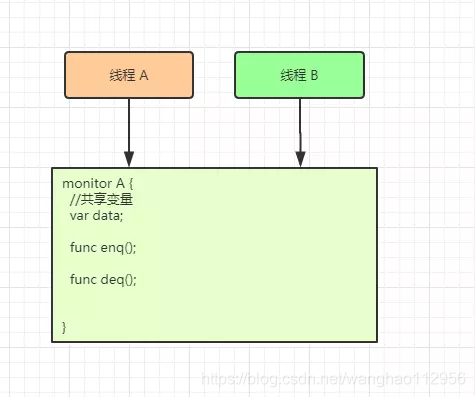
> &emsp;在管程模型里，共享变量和对共享变量的操作是被封装起来的，图中最外层的框就代表封装的意思。框的上面只有一个入口，并且在入口旁边还有一个入口等待队列。当多个线程同时试图进入管程内部时，只允许一个线程进入，其他线程则在入口等待队列中等待。这个过程类似就医流程的分诊，只允许一个患者就诊，其他患者都在门口等待。
> &emsp;管程里还引入了条件变量的概念，而且每个条件变量都对应有一个等待队列，如下图，条件变量 A 和条件变量 B 分别都有自己的等待队列。
> 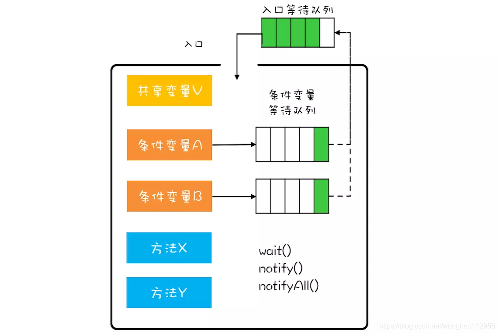

**我们通过一段代码说明，实现一个阻塞队列，队列分别有出队与入队，都是要先获取互斥锁，就像管程中的入口。**
* 对于入队操作，如果队列已满，就需要等待直到队列不满，所以这里用了notFull.await();。
* 对于出队操作，如果队列为空，就需要等待直到队列不空，所以就用了notEmpty.await();。
* 如果入队成功，那么队列就不空了，就需要通知条件变量：队列不空notEmpty对应的等待队列。
* 如果出队成功，那就队列就不满了，就需要通知条件变量：队列不满notFull对应的等待队列。
```
    public class BlockedQueue<T>{
      final Lock lock = new ReentrantLock();
      // 条件变量：队列不满  
      final Condition notFull = lock.newCondition();
      // 条件变量：队列不空  
      final Condition notEmpty = lock.newCondition();
     
      // 入队
      void enq(T x) {
        lock.lock();
        try {
          while (队列已满){
            // 等待队列不满 
            notFull.await();
          }  
          // 省略入队操作...
          // 入队后, 通知可出队
          notEmpty.signal();
        }finally {
          lock.unlock();
        }
      }
      // 出队
      void deq(){
        lock.lock();
        try {
          while (队列已空){
            // 等待队列不空
            notEmpty.await();
          }
          // 省略出队操作...
          // 出队后，通知可入队
          notFull.signal();
        }finally {
          lock.unlock();
        }  
      }
    }

```


1. 为什么要引入管程
* 信号量机制是一种进程同步机制，但每个要访问临界资源的进程都必须自备同步操作wait(S)和signal(S)。这样大量同步操作分散到各个进程中，可能会导致系统管理问题和死锁，在解决上述问题的过程中，便产生了新的进程同步工具——管程。
> wait(c)表示为进入管程的进程分配某种类型的资源，如果此时这种资源可用，那么进程使用，否则进程被阻塞，进入紧急队列。
> signal(c)表示进入管程的进程使用的某种资源要释放，此时进程会唤醒由于等待这种资源而进入紧急队列中的第一个进程。

2. 管程的定义和基本特征
* 一个管程定义了一个数据结构和能为并发进程所执行(在该数据结构上)的一组操作，这组操作能同步进程和改变管程中的数据

**由上述的定义可知，管程由四部分组成：**
* 管程的名称;
* 局部于管程的共享数据结构说明;
* 对该数据结构进行操作的一组过程;
* 对局部于管程的共享数据设置初始值的语句。
> 实际上，管程中包含了面向对象的思想，它将表征共享资源的数据结构及其对数据结构操作的一组过程，包括同步机制，都集中并封装在一个对象内部，隐藏了实现细节。封装于管程内部的数据结构仅能被封装于管程内部的过程所访问，任何管程外的过程都不能访问它;反之，封装于管程内部的过程也仅能访问管程内的数据结构。所有进程要访问临界资源时，都只能通过管程间接访问，而管程每次只准许一个进程进入管程，执行管程内的过程，从而实现了进程互斥。

**管程的特性：**
管程是一种程序设计语言的结构成分，它和信号量有同等的表达能力，从语言的角度看，管程主要有以下特性
* 模块化，即管程是一个基本程序单位，可以单独编译;
* 抽象数据类型，指管程中不仅有数据，而且有对数据的操作；
* 信息屏蔽，指管程中的数据结构只能被管程中的过程访问，这些过程也是在管程内部定义的，供管程外的进程调用，而管程中的数据结构以及过程(函数)的具体实现外部不可见。

3. 管程和进程的比较
* &emsp;虽然二者都定义了数据结构，但进程定义的是私有数据结构PCB，管程定义的是公共数据结构，如消息队列等;
* &emsp;二者都存在对各自数据结构上的操作，但进程是由顺序程序执行有关操作，而管程主要是进行同步操作和初始化操作；
* &emsp;设置进程的目的在于实现系统的并发性，而管程的设置则是解决共享资源的互斥使用问题;
* &emsp;进程通过调用管程中的过程对共享数据结构实行操作，该过程就如通常的子程序一样被调用，因而管程为被动工作方式，进程则为主动工作方式;
* &emsp;进程之间能并发执行，而管程则不能与其调用者并发;
* &emsp;进程具有动态性，由“创建”而诞生，由“撤消”而消亡，而管程则是操作系统中的一个资源管理模块，供进程调用。


拓展1：用管程解决生产者消费者问题

```
monitor producerconsumer
  condition full,empty;
  int count = 0;
  void insert(Item item){
    if(count == N)
      wait(full);
    count++;
    insert_item (item);
    if(count == 1)
      signal(empty);
 }
  Item remove(){
    if(count == 0)
      wait(empty);
    count--;
    if(count == N-1)
      signal(full);
    return remove_item();
 }
  end monitor;
​
//使用
producer(){
  while(1){
    item = 生产一个产品;
    producerconsumer.insert(item);
 }
}
​
consumer(){
  while(1){
    item = producerconsumer.remove();
    消费产品 item;
 }
}
```


## 2.4_1 死锁的概念
1. 什么是死锁

各进程互相等待对方手里的资源，导致各进程都阻塞，无法向前推进的现象。

2. 进程死锁. 饥饿. 死循环的区别
  
**死锁：**
* 定义：各进程互相等待对方手里的资源，导致各进程都阻塞，无法向前推进的现象。
* 区别：至少两个或两个的进程同时发生死锁

**饥饿：**
* 定义：由于长期得不到想要的资源，某进程无法向前推进的现象。
* 区别：可能只有一个进程发生饥饿

**死循环：**
* 定义：某进程执行过程中一直跳不出某个循环的现象。
* 区别：死循环是程序员的问题

3. 死锁产生的必要条件
* 互斥条件：多个进程争夺资源发生死锁
* 不剥夺条件：进程获得的资源不能由其它进程强行抢夺
* 请求和保持条件：某个进程有了资源，还在请求资源
* 循环等待条件：存在资源的循环等待链

4. 什么时候会发生死锁
* 对系统资源的竞争
* 进程推进顺序非法
* 信号量的使用不当也会造成死锁

5. 死锁的处理策略
* 预防死锁
* 避免死锁
* 死锁的检测和解除


## 2.4_2 死锁的处理策略——预防死锁
1. 不允许死锁发生

**静态策略：预防死锁**

* 破坏互斥条件（有些不能破坏）
>把互斥的资源改造为共享资源

* 破坏不剥夺条件（复杂，造成之前工作失效，降低系统开销，会放弃之前获得的资源.如果一直发生这种情况，则会导致饥饿）
> 方案1：当请求得不到满足的时候，立即释放手里的资源
> 方案2：由系统介入，强行帮助剥夺

* 破坏请求和保持条件（资源利用率极低，可能会导致某些进程饥饿）
>采用静态分配方法，一次性申请它所需要的全部资源，如果申请不到，不要允许

* 破坏循环等待条件（不方便增加新的设备，实际使用与递增顺序不一致，会导致资源的浪费，必须按规定次序申请资源）
> 顺序资源分配法：对资源编号，进程按编号递增顺序请求资源

**动态检测：避免死锁**

2. 允许死锁发生

死锁的检测和解除

## 2.4_3 死锁的处理策略——避免死锁
**动态检测：避免死锁**

**什么是安全序列？**
&emsp;指如果系统按照这种序列分配资源，则每个进程都能顺利完成。
**什么是系统的不安全状态，与死锁有何联系？**
&emsp;如果系统处于安全状态，就一定不会发生死锁。如果系统进入不安全状态，就可能发生死锁（处于不安全状态未必就是发生了死锁，但发生死锁时一定时在不安全状态）
**如何避免系统进入不安全状态——银行家算法？**
&emsp;初始分配完成后，优先全部分配给最少的，并且拿回资源

**步骤：**
1. 检查此次申请是否超过了之前声明的最大需求数

2. 检查此时系统剩余的可用资源是否还能满足这次请求

3. 试探着分配，更改各数据结构（并非真的分配，修改数值只是为了做预判）

4. 用安全性算法检查此次所分配是否会导致系统进入不安全状态

## 2.4_4 死锁的处理策略——检测和解除
死锁的检测

1. 用**某种数据结构**来保存资源的请求和分配信息

2. 提供**一种算法**，利用上述信息来检测系统是否已进入死锁状态

死锁的解除

1. 资源剥夺法：挂起某些死锁进程，并抢占它的资源，将这些资源分配给其他的死锁进程。

2. 撤销进程法(终止进程法)：强制撤销部分，甚至全部死锁进程，并剥夺这些进程的资源。

3. 进程回退法：让一个或多个死锁进程回退到足以避免死锁的地步。

