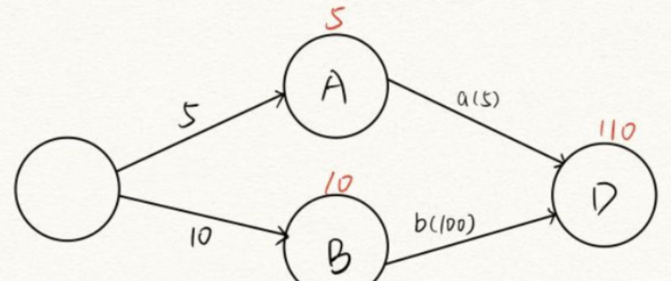

# 算法相关
## 关键路径
**1.开始与发生**
> &emsp;“发生”是针对于事件的，也就是图中的顶点。只有在指向该顶点的所有有向边对应的活动结束，该顶点所代表的事件才发生。
> &emsp;举个例子，一个事件C，它仅被两条边a, b指向，仅当a，b两活动都完成时，事件C发生。

> &emsp;“开始”是针对于活动的，也就是图中的边。只有在一个顶点所代表的事件发生后，从该顶点出发的所有边对应的活动才能开始。
> 
> &emsp;如图，A,B,D即为事件，a(5), b(100)即为活动
> 想要完成D，就需要先完成活动a和b，但a和b发生的时间是互不影响的，也就是说，a可以在b进行到一半再进行，也可以和b一起发生，因为它们在不同的事件当中。
> 
> &emsp;**如此便衍生出了四个变量：**
> &emsp;&emsp;ve(i):事件i最早发生时间
> &emsp;&emsp;vl(i):事件i最晚发生时间
> &emsp;&emsp;e(i) :活动i最早发生时间
> &emsp;&emsp;l(i) :活动i最晚发生时间
> &emsp;为了不拖延事件D完成的最终时间，因此活动a可以在b进行到95min时再进行，最后与b一起完成，那么95min就是事件A的最晚发生时间，也是活动a的最晚发生时间。a的最早开始时间为5，b为10。最早开始时间即满足前置活动后马不停蹄立刻开始的时间。
> **注1：当一个事件只指出了一个活动，那么该事件与该活动的最早时间、最晚时间相同。**
> **注2：但如果一个事件指出了多个活动，那么该事件的最晚(最早)发生时间是这些活动最晚(最早)开始时间的最小者，因为活动必须在事件完成后才能执行，无论是想早点开始或者晚点开始，都必须等事件完成后。（从同一个事件指出的活动，如果最早发生时间不同，往往受活动之间的制约影响，事件的个数是人为规定的，而不受活动的影响。）**
> **注3：想要求得关键路径，就要找到$e(i)==l(i)$的活动，即活动的最早最晚开始时间相同，换个说法，这个活动十万火急，不能有半点岔子，上一个事件结束就必须立刻开始这个活动，即最早发生时间，但同时又要保证前面的事件已被完成，即要完成指向该事件的所有活动，这个过程所消耗的时间即耗时最多的活动，这就是活动的最晚开始时间，因此两者在数值上相同。**
>
> &emsp;如图所示，a可以马不停蹄的进行，即事件A完成后立刻进行，但它还需要等待b完成才能一起走向事件D，而活动b为了不拖慢项目的进度，在事件B完成后立刻开始，因此b的最晚开始时间与最早开始时间相同，则b为关键活动。
>
> 
> &emsp;**在算法中，事件的个数是人为规定的，而不受活动的影响，因此我们规定有多少活动就有多少事件，每个事件代表一个活动完成，从而把重心放在活动上，令图中的事件顶点K为已完成活动K，指向顶点K的边的权重为完成活动K的时间，有多少个事件顶点就有多少个活动。**
> &emsp;对ve，vl进行重定义：
> **ve（j）代表的是弧尾j(箭头的一方)的最早发生时间（可以理解为事件最早发生时间）**
> **vl（k）代表的是弧头k的最晚发生时间（可以理解为事件最晚发生时间）**
> **dut（<j,k>）代表该活动要持续的时间，既是弧的权值**
>
> 则有
> ————————————————————————————————
> ve（j）=Max{ve{i}+dut(<i,j>)};
> <i,j>属于T，j=1,2.....n-1，
> 其中T是所有以第j个顶点为头的弧的集合。n为顶点的个数。
> ————————————————————————————————
> vl（i）=Min{vl(j)-dut(<i,j>)}
> <i,j>属于S，i=n-2,n-3.....0
> 其中，S是所有以第i个顶点为尾的弧的集合
> **因为弧长越长，活动就越耗时，就应该越早开始事件**
>  ————————————————————————————————
> $e(i)==l(i)$&emsp;即&emsp;$ve(i)=vl(j)-dut<i,j>$
> **由于每个事件定义为某一活动完成，因此事件的最早开始时间即下一个活动的最早开始时间，下一个活动完成这个事件的最晚发生时间减去该活动的耗时即该活动的最晚开始时间。**
>

