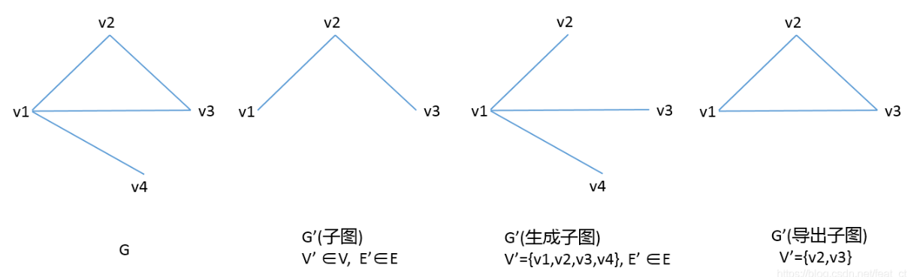

# 主析取式与主合取式
> 对于给定的一个命题，需要先求其主析取式，即m0,m1....mn,也即成真赋值，他们的联结词必须为析取符号，而每一项为合取符号。
> 然后可以根据非真即假的理念直接得出主合取式，例如，若求得主析取式为m1,m2(两个变项)，则主合取式为M3,M4.
> 当式子很复杂时，不妨将其转化为数电的形式，合取符号即“·”,析取符号即“+”

# 商集的“商”字如何理解？
>设有一个集合A={a, a1,b,b1,b2}，等价关系R为相似矩阵，A中a与a1相似，b与b1、b2相似，则a的等价类为{a,a1}， b的等价类为{b,b1,b2}， 商集A/R={ {a,a1}, {b,b1,b2}}。可以看出，集合A被关系R拆分成为了两个子集，类似于运算中的除法，比如8/4就是8被4拆分成了两部分，8就是集合A，4就是关系R，都是A被R拆分，所以得出的结果就叫商集

# 图
>初级通路是每个结点只经过一次，简单通路是边只经过一次
>欧拉图就是从图上的一点出发，经过所有边且只能经过一次，最终回到起点的路径。
>欧拉通路：即可以不回到起点，但是必须经过每一条边，且只能一次。也叫"一笔画"问题。

>自反闭包r(R):将没有环的结点加上环

>对称闭包s(r):将只有一条边相连的两个结点之间加上一条相反的边。

>传递闭包t(R):就像抄近道一样，将通过两条及以上的边相连的结点连起来。
>对于n阶m条边的连通图G，有m >= n - 1

>平面图所有面的次数之和等于边数的两倍

>任何无向图中，所有顶点的度数之和等于边数的2倍

>任何有向图中，所有顶点的度数之和等于边数的2倍；所有顶点的入度之和等于所有顶点的出度之和，都等于边数

>n个顶点的有向完全图有n（n-1）条边

>n个顶点的无向完全图有 n（n-1）/2 条边

>无向图G是欧拉图当且仅当G是连通图且没有奇度顶点

>无向图G是半欧拉图(无欧拉回路)当且仅当G是连通的且恰有两个奇度顶点

>有向图D是欧拉图当且仅当D是强连通的且每个顶点的入度等于出度

>有向图D是半欧拉图当且仅当D是单向连通的且恰有两个奇度顶点，其中一个顶点的入度比出度大1，另一个顶点的出度比入度大1，而其余顶点的入度等于出度。

>子图
>定义：子图G’中所有的顶点和边均包含于原图G。即E’∈E，并且V’∈V。

>生成子图（Spanning Subgraph）
>定义：生成子图G’中顶点个数V’必须和原图G中V的数量相同，而E’∈E即可。

>导出子图(Induced Subgraph)
>定义：导出子图G’，V’∈V，但对于V’中任一顶点，只要在原图G中有对应边，那么就要出现在E’中。

>生成树
>定义：如果无向图G的生成子图T是树，则称T是G的生成树，G的在T中的边称为树枝，不在T中的边称为T的弦。

>设T是n阶非平凡的无向树，则T中至少有两片树叶。
&emsp; 证明 设T有x片树叶，由握手定理（图的所有顶点的度数之和等于边数的两倍）以及树的充分必要条件，2(n – 1) = Σd(vi)≥x + 2(n – x)。解得x≥2。（方程的最右端代表叶节点的总度数（每片树叶1个度）加上其它节点的度数（每个节点至少2个度））

>完全图首先是一个简单图，即没有环也没有重边的图。且任意一个顶点都与其它每个顶点有且只有一条边相连接，n个顶点的完全图用Kn表示，称为n阶完全图。

# 函数
> ran:range 值域 
> dom:domain 定义域
>

# 树
> 对于n阶m条边的无向图G, G为树，有m = n - 1
> 但

# 二元关系
> 哈斯图的画法：
> 第一步：找值域中没有出现的元素放第一排；
> 第二步，去掉以第一排元素为前域的所有关系，再找值域中没有出现的元素(注：以集合为对象查找，而非二元关系中查找)（此时第一排的元素已被除去）；
> 第三步，以此类推

> 哈斯图只能向上寻找

> 最大元素就是在子集中处于最高层且每个元素通过图中路径都可以找到它且它的上面没有元素。

>最小元素就是在子集中处于最低层且每个元素通过图中路径都可以找到它且它的下面没有元素。

>极大元素就是在子集中它的上面没有元素。

>极小元素就是在子集中它的下面没有元素。

>（记住：这里如果是子集，应当将子集当成一个单独的整体，而不受全集的影响。）

>上届：所有子集内的元素沿着路径向上都可以找到的元素（这里包括子集和子集以外的元素）。根据上面所说的话，我们可以断定上届也可以是子集内的元素。

>下届：所有子集内的元素沿着路径向下都可以找到的元素（这里包括子集和子集以外的元素）（第一层的元素不能向下，所以不用考虑最底层）。根据上面所说的话，我们可以断定下届也可以是子集内的元素。

>上确界：这里我们可以将上届元素看成一个独立的整体，而上确界就是这个集合的最小元，我们称为最小上届。根据上面所说的话，我们可以断定上届也可以是上确界。

>下确界：这里我们可以将下届元素看成一个独立的整体，而下确界就是这个集合的最大元，我们称为最大下届。根据上面所说的话，我们可以断定下届也可以是下确界。