## 算法概念基础
**增长次数描述：渐进符号**
1. 上界$\Omicron$的定义：
* 如果存在大于0的常数c和非负整数$n_0$，使得$\forall n > n_0, t(n)\leq cg(n)$，我们称函数$t(n)$包含在$\Omicron(g(n))$中，记作$t(n) \in \Omicron(g(n))$。
* 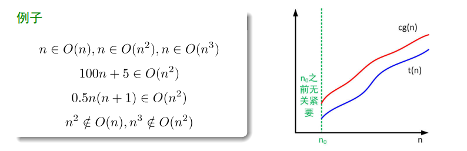
2. 下界$\Omega$的定义：
* 如果存在大于0的常数c和非负整数$n_0$，使得$\forall n > n_0, t(n)\geq cg(n)$，我们称函数$t(n)$包含在$\Omega(g(n))$中，记作$t(n) \in \Omega(g(n))$。
* 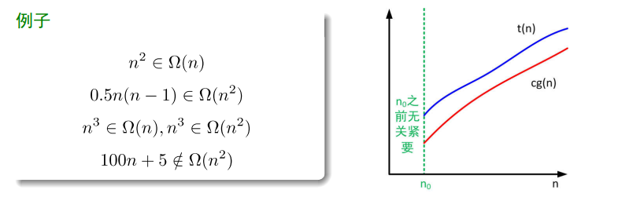
3. $\Theta$的定义：
* 如果存在大于0的常数c和非负整数$n_0$，使得$\forall n > n_0, c_1g(n) \leq t(n)\leq c_2g(n)$，我们称函数$t(n)$包含在$\Theta(g(n))$中，记作$t(n) \in \Theta(g(n))$。
* 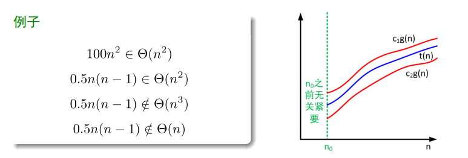

**渐进符号特性**
* 定理：如果$t_1(n)\in \Omicron(g_1(n))$, 并且$t_2(n)\in \Omicron(g_2(n))$, 则$t_1(n)+t_2(n)\in \Omicron(max\{g_1(n), g_2(n)\})$
* 对于$\Omega$和$\Theta$符号，类似的断言也成立。
* 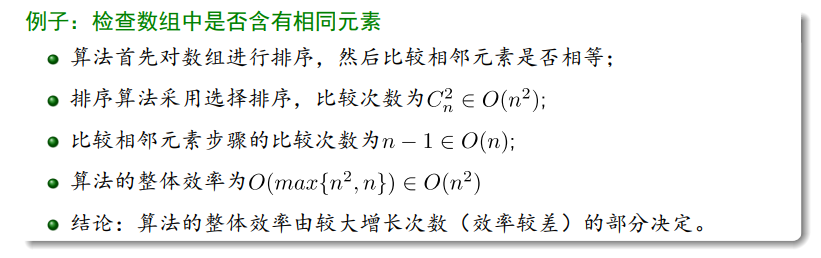

**利用极限比较增长次数**
* 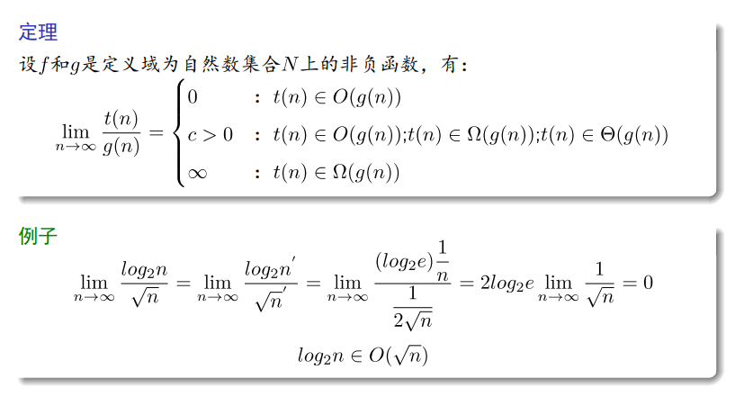

**算法的三种效率**
* 最差效率$C_{worst}(n)$：输入规模为n时，算法在最坏输入下的效率；
* 最优效率$C_{best}(n)$：输入规模为n时，算法在最好输入下的效率；
* 平均效率$C_{avg}(n)$：输入规模为n时，算法在随机输入下的效率；

**基本效率类型**
* 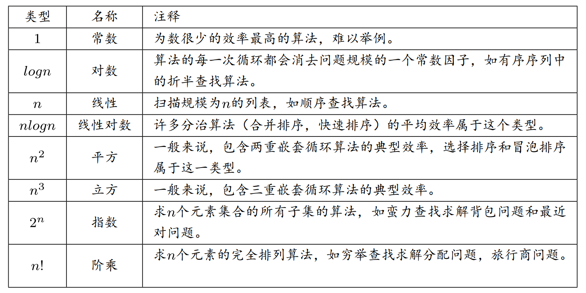

**递归方程求解-主定理**
* 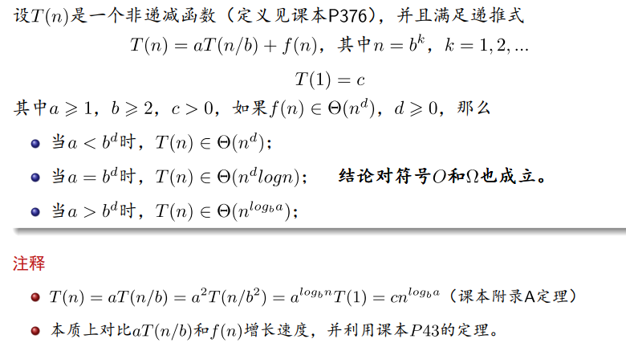
* 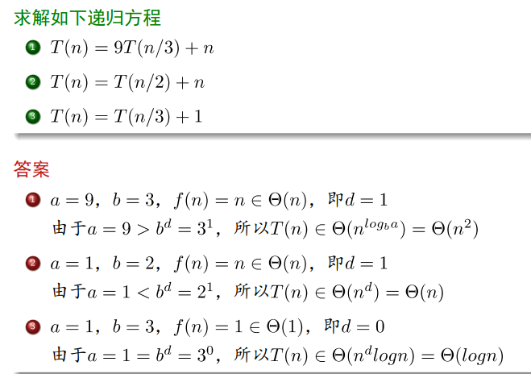

**归并排序算法效率分析**
* 算法基本操作：元素之间的比较；
* 比较次数C(n)的递推关系：
  * $C(n) = 2C(n/2)+C_{merge}(n), C(0)=1, 其中n=2^k$
* 最坏情况：$C_{merge}(n)=n-1$
* 最欢情况下的效率
$$C_{worst}(n)\begin{cases}
2C_{worst}(n/2)+n-1 & n>1\\
0 & n=1
\end{cases}
$$
* 根据主定理可得$C_{worst}(n)\in \Theta (nlogn)$
* 缺点：需要线性的额外空间

**快速排序算法效率分析**
1. 最差情况
* 对序列$[1,2,3,4,5,6,7,8,9,10]$进行排序;
* 从左到右扫描停留在$A[1]$(比较1次)，从右到左扫描，停留在$A[0]$(比较n次);
* $A[0]$和本身交换，然后继续递归排序$[2,3,4,5,6,7,8,9,10]$;
* 第1次分裂需要比较$n+1$次;
* 第2次分裂需要比较$n$次;
* 最好一次分裂比较3次（$A[left]$比较1次，$A[right]$比较2次）;
* $C_{worst}(n)=(n+1)+n+...+3=(n+1)(n+2)/2-3 \in \Theta(n^2)$
2. 最优情况
* 最优情况下，数组序列被分为两个大削差不多规模的子序列;
* $C_{best}(n)=2C_{best}(n/2)+\Theta(n), C_{best}(1)=0$;
* 根据主定理可得$C_{best}(n)\in \Theta(nlog_2n)$;
3. 平均情况
* 经过$n+1$次比较，分裂点出现在任意的位置($0\leq s \leq n-1$), 划分数组为大小s和n-1-s两个部分，每种情况出现的概率为$1/n$;
* 递推方程：$C_{avg}(n)=\frac{1}{n}\sum^{n-1}_{s=0}[(n+1)+C_{avg}(n-1-s)], C_{avg}(1)=C_{avg}(0)=0$
* 计算可得$C_{avg}(n) \approx 2nln2 \approx 1.39nlog_2n$
* 算法平均情况下的效率仅比最优情况下多执行39%的计算

**堆的构造-自底向上**
* 时间复杂度
* 最坏情况下，每一层节点的键都会交换到最底层;
* 移动一次需要两次比较：是否执行交换和找出最大的子女;
* 第$i$层的每个节点（一共有$2^i$个）需要$2(h-i)$次键值比较;
* $C_{worst}(n)=\sum_{i=0}^{log_2n-1}2^i*2(log_2n-i)=2(n-log_2(n+1))$

**堆的构造-自顶向下（效率较低）**
* 方法要点
1. 通过把新的键连续插入预先构造好的堆来构造新的堆；
2. 把一个键值为$K$的节点附加在当前堆的最后一个叶子节点后；
3. 比较$K$和其父节点的大小，如果父节点的键值小，则交换；
4. 重复上述步骤，直到遇到键值大于$K$的父节点或者位于根节点；

**堆的操作**
1. 插入操作
* 与**自顶向下**构造堆相似，最坏情况下的复杂度为$O(log_2n)$（树的高度）
2. 删除操作
* 要删除的节点和堆的最后一个节点交换，然后删除；
* “堆化”（自底向上构造堆步骤 ）删除后的树；

**堆排序**
* 算法步骤
1. 构造堆，即为一个给定数组构造一个堆；
2. 删除最大键，即对剩下的堆应用$n-1$次根删除操作；
* 复杂度分析
1. 第一阶段（构造堆 自底向上）复杂度为$O(n)$;
2. 第二阶段（删除最大键）键值比较次数:
* $C(n)\leq 2log_2(n-1)+2log_2(n-2)+...+2log_21 \leq 2nlog_2n$
3. 总的效率为$O(nlogn)$（任何情况），且无需额外存储空间;
4. 对于随机的输入，堆排序比快速排序运行的慢;

**排序算法性能**
* 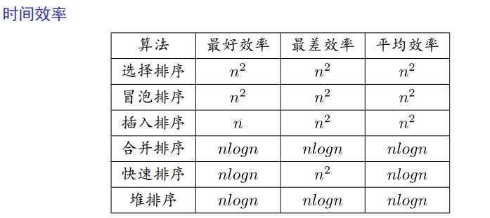
* 注意
1. 合并排序的主要缺点是需要线性的额外空间
2. 平均来说，快速排序的运行时间比合并排序要快一点；
3. 堆排序不需要额外空间，比快速排序平均运行时间要多一点；

**选择问题**
* 问题的一般描述
* 设L是n个元素的集合，从L中选择第k小的元素，当L中的元素从小到大排列
后，排在第k个位置的元素。
1. $k = 1$：最小元素；
2. $k = n#：最大元素；
3. $k = n - 1$：第二大元素；
4. $k = \lfloor n/2 \rfloor$：中位数；

**同时选最大和最小**
* 分治算法
1. 将L从中间划分为$L_1$和$L_2$ ；
2. 递归的在$L_1$中找最大$max_1$和最小$min_1$；
3. 递归的在$L_2$中找最大$max_2$和最小$min_2$；
4. $max \leftarrow max(max_1, max_2)$；
5. $min \leftarrow min(min_1, min_2)$；
* 效率分析
* 比较次数递归方程：$W(n)=2W(n/2)+2, W(2)=1, n=2^k$；
* 递推计算可得：$W(n)=3n/2-2$；

**一般性选择问题（选择第k小）**
* 分治法求解思路
1. 用某个元素$m*$作为比较标准将$S$划分成$S_1$与$S_2$；
2. 如果$k \leq |S_1|$，则在$S_1$中找第$k$小；
3. 如果$k=|S_1|+1$，则在$m*$是第$k$小；
4. 如果$k>|S_1|+1$，则在$S_2$中找第$k-|S_1|-1$小；
* 注意
1. 寻找$m*$（选择问题）的代价不能太高，假设为$T(cn)$；
2. 算法在最坏的情况下总进入$S_1$和$S_2$中较大（规模为$dn$）的子集；
3. 定理：当$c+d<1$时，$T(n)=T(cn)+T(dn)+O(n) \in O(n)$；
4. 在寻找$m*$时应保证$c+d<1$才能够保证算法复杂度为$O(n)$；

**快速选择算法**
* 算法思想
1. 快速排序算法按照元素的值进行划分子问题：
* 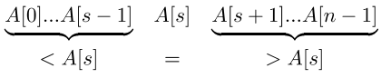
2. $A[s]$是第$s+1$小的元素；
3. 如果$k=s+1$，则$A[s]$是要找的元素；
4. 如果$k>s+1$，则在$A[s+1]...A[n-1]$中寻找；
5. 如果$k<s+1$，则在$A[0]...A[s-1]$中寻找；
6. 如此重复划分过程，直到$k=s+1$；
7. 划分方法： Lomuto算法， Hoare划分方法；
* 伪代码
* 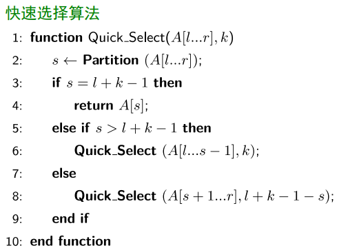

**动态规划思想**
* 要点：如果原问题是由交叠的子问题构成（递归调用），动态规划对每个子问题只求解一次，并把结果记录在表中，递推计算得到原始问题的解。
* 求解过程：
1. 穷举分析
2. 分析找规律，拆分子问题
3. 最简单的边界情况
4. 确定最优子结构
5. 状态转移方程

**Prim算法**
* 算法流程
1. 任意选一点$v_0$，集合$V$被分割成两个集合$V_T={v_0}$和$V - V_T$；
2. 从连通$V_T$和$V - V_T$的边中挑选一条权重最小的边$e* = (v*, u*)$，
，$v* \in V_T, u* \in V - V_T$, 将$u*$加入$V_T$中，从$V - V_T$删除$u*$；
3. 重复步骤2，直到集合$V - V_T$为空；

**Kruskal算法**
* 算法流程
1. 按照权重非递减顺序对图中的边$E$进行排序；
2. 扫描以排序的列表，如果下一条边加入到当前的子图中不导致一个回路，
则加入该边到子图中，否则跳过该边；
3. 重复步骤2，直到子图中有$|V|-1$条边；

**Dijkstra算法**

