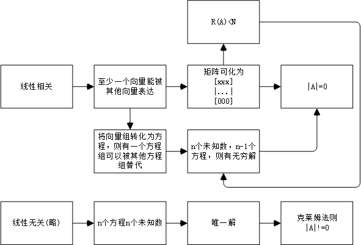

# 行列式
1. 观察不同行列间的关系
2. 观察每一行（列）之和的关系
3. 观察是否符合范德蒙行列式的形式
4.	观察展开式是否能构成递推公式，并使用特征方程
5.	对行列式求导等价于对每一行（列）求导后相加
6.	巧用行列式乘法可进行化简

# 矩阵
1. 推演法：当无从下手时，利用所有已知条件构建条件衍生树，依次试探是否可行。

# 线性方程
1. 线性相关性

 
2. **求解方程时的分而治之思想：** 对于 **AB=C** 这样的方程，它不同于一般的方程**AB = b** ，但可以对于C的每一列进行分而治之，例如 **C=E** 时 可以将问题拆分为**AB=e1**....**AB=en** , 其中e1 = (1,0,0..).T, 求出每一个子问题的通解**x1,x2...xn** 后，最后的正确结果为**X=(x1,x2..xn)**
 
3. **Ax = b** 的通解可以通过增广矩阵(**A|B**)消元法得出，得到**X = b'+t1·c1+...+tn·cn** , 其中(t1,t2..tn)为任意常数，而另一方法为求得一特解，再求得**Ax =0** 的同解，则**通解=特解+同解**，此处的特解可以理解为消元法结果中的**b'** ,同解可理解为**t1·c1+...+tn·cn**  
 
4. 线性表出类问题的解题技巧见《高等代数》P95
 
5. **向量组间的线性表出问题的集中治理思想：** 若向量组A(a1,a2,a3)能被B(b1,b2,b3)表出时，即A中的所有向量都能被B线性表示，按照一般的思路，可以分别构造(B|a1)等增广矩阵进行求解讨论(化为方程组从而进行系数行列式法或者通过秩来判断)，但如此过于麻烦，可直接构造增广矩阵(B|A)，通过讨论秩来进行求解。
* **注意事项：**
* 1.若方程个数等于未知量个数的非齐次线性方程组，只要|A|!=0,则必有唯一解，但是if |A|==0:!=> 一定有无穷多组解，也有可能没有解，即|A|==0是方程组无解(线性无关)的必要不充分条件，因此做题时需要验算(通常采用增广矩阵)。 
* 2.如果将方程改写为矩阵的形式，请注意列数与未知量的对应关系（以及未知量是自变量还是系数，也即观察方程是参数方程还是一般方程）例如：x1**a1**+x2**a2**+x3**a3**=**P** 则构成的矩阵的第一列也就象征a1，其中的数字系a1的系数。