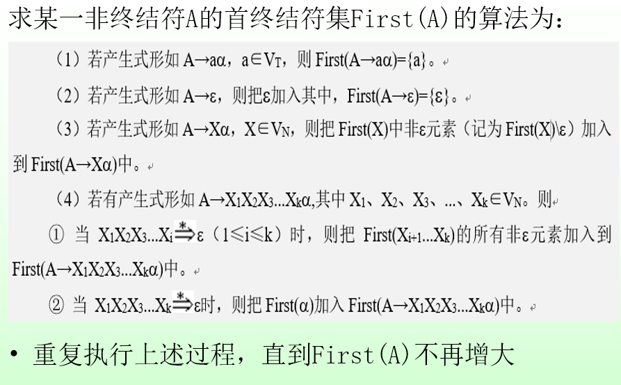
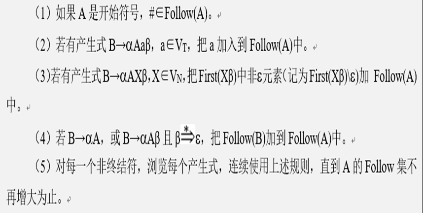
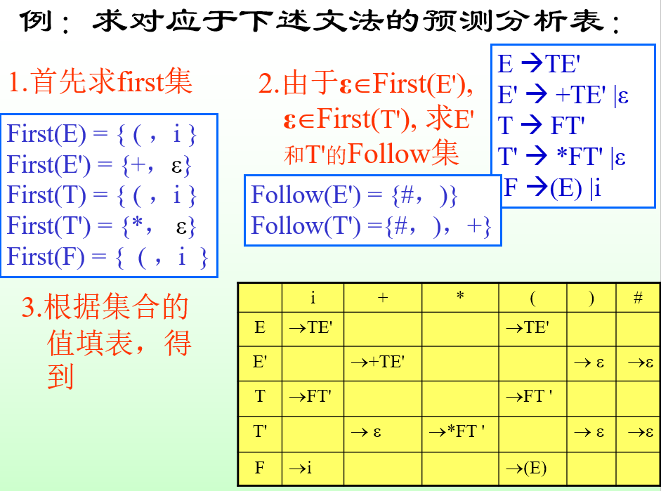
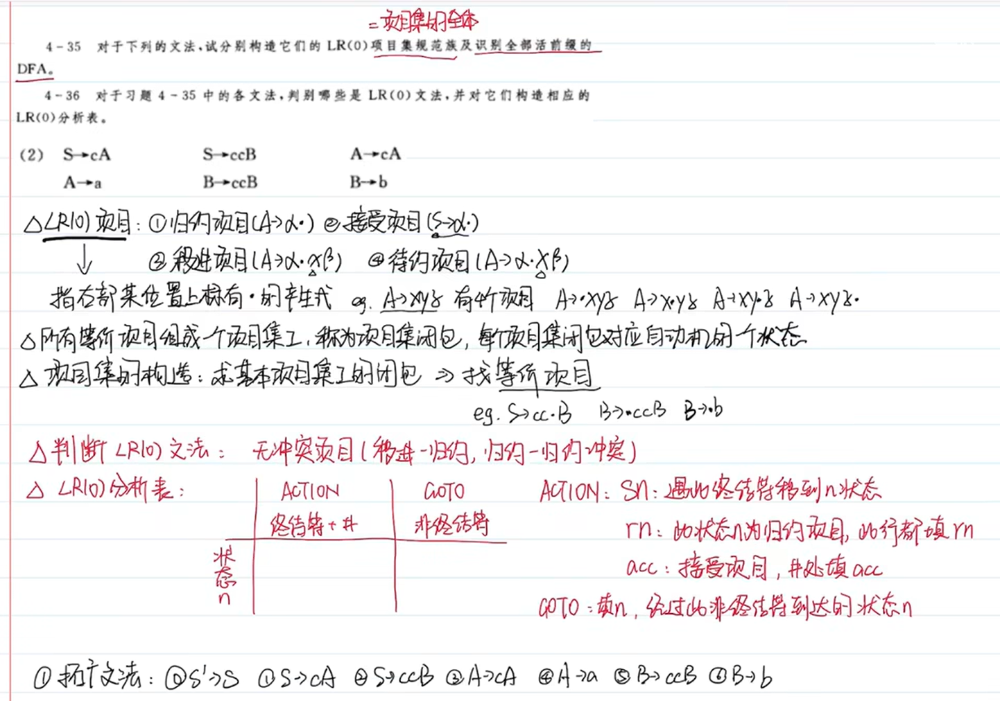
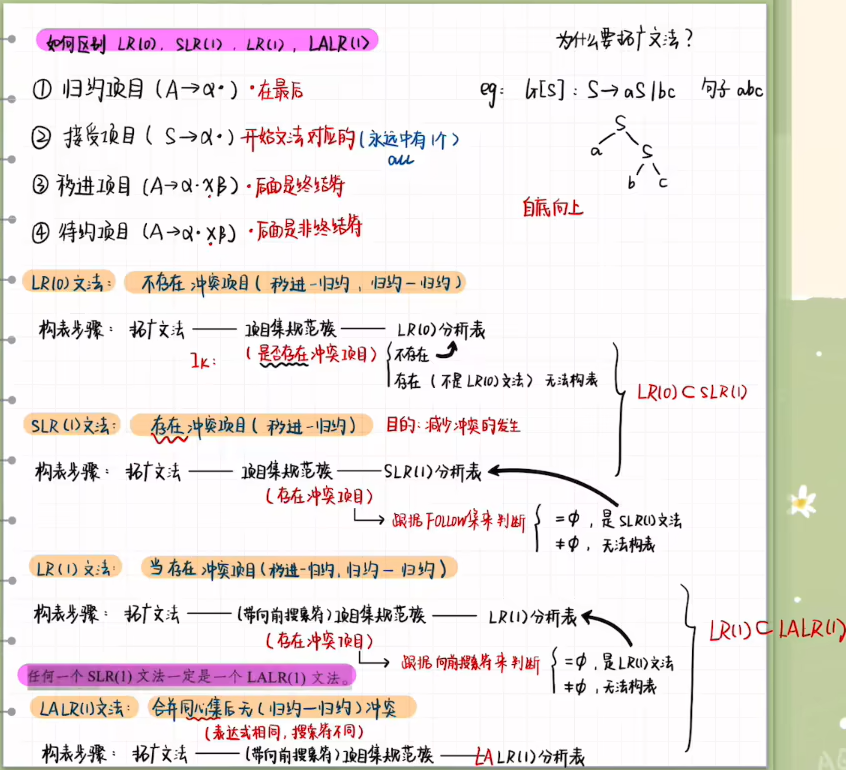
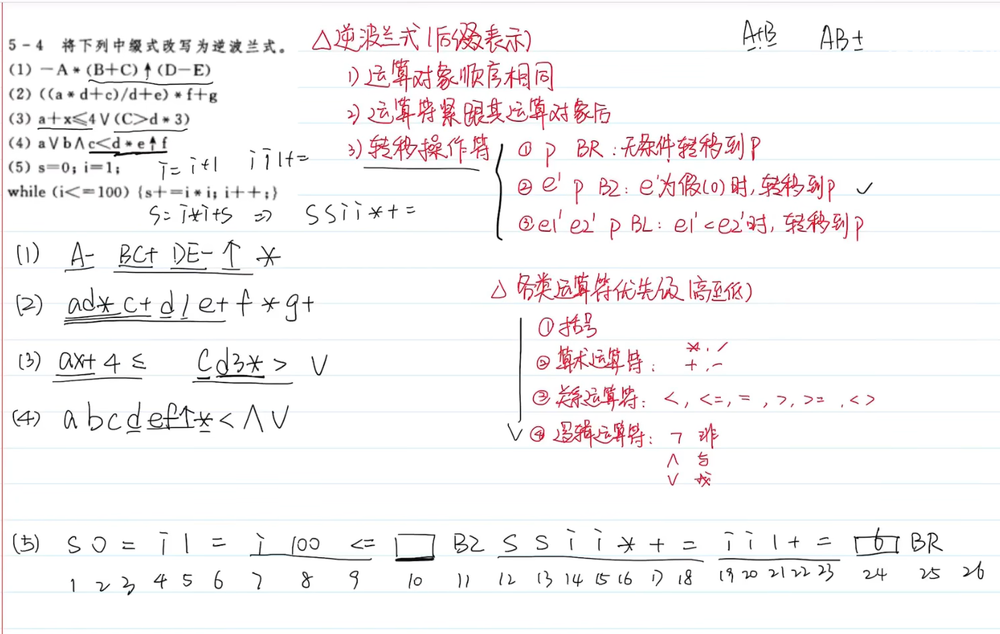

**若文法出现死循环**
1. 消除回溯
> 方法是:反复 “提取公共左因子”，使得文法的每个非终结符号的各个候选式的**首终结符集**两两不相交，来避免回溯。
> Eg: 
> A→**δ**β1 |**δ**β2 | … |**δ**βn| γ1 |γ2 | … | γm 
> 替换为:
> A →**δ**A' | γ1 | γ2 |…| γm
> A'→β1 | β2 | … | βn
> Eg:
> S → (T) | **a** + S | **a**
> T → T,S | S
> 替换为：
> S → (T) | **a**S' 
> S’→ + S | ε
> T → T,S | S

2. 消除左递归
> 假定产生式为： $A→A \alpha | β$，将其替换为形式等价的产生式组，把最左边的A去掉(消除直接左递归)
> Eg:
> E → **E**+T | T
> T → **T***F | F
> F → (E) | i
> 替换为
> E → TE'
> E'→+TE' | ε
> 
> T → FT'
> T'→*FT' | ε  
>
> F → (E) | i
> **可以先推导几项，然后得出替换后的式子**

**如果希望没有回溯，对文法有什么要求？**
> **回溯产生的真正原因**：某非终结符对应多个侯选式，它们右部的第一个终结符相同，从而导致语法分析器选择了错误的侯选式。
> Eg: 
> S → xAy 
> A → >= | >
> 有First(A1) = {>} First(A2) = {>}
> 如果现在有一个字符串需要匹配 >，假如A选择了候选式 '>'，而字符串下一个字符需要匹配 '='，就无法继续匹配，则需要**回溯**，然后重新选择候选式 '>='
> **不产生回溯的条件**：对非终结符A的任意两个不同的侯选式ai 和aj ，都有：First(ai)∩ First(aj) = φ
> &emsp;当要求用A进行匹配时，就能根据所面临的输入字符，准确地选取一个A的侯选式

**(对文法进行不带回溯的确定的自顶向下分析的条件)，据此判别是否为LL(1)文法。**
1. 文法不含左递归(防止死循环)
2. 对文法中的任一个非终结符A的各个产生式的侯选首终结符集两两不相交，即：若 A → α1|α2|…|αn  ，则First(ai)∩ First(aj) = φ   ( i ≠ j )（防止回溯）
3. 对文法中的每个非终结符A,若它的某个首终结符集含有ε ，则First(A)∩ Follow(A) = φ（是为了确保在进行LL(1)分析时不会出现二义性，即每个非终结符的产生式可以通过唯一的推导路径进行规约）（First(A)代表在句子中紧跟在A后面可能出现的终结符集合，Follow(A)代表在句子中紧跟在A后面可能出现的终结符集合）

**求非终结符A的First集的算法**

**求非终结符A的Follow集的算法**

**根据 LL(1)的三个条件来判断.判别步骤:**
1. 首先检查是否含有左递归
2. 若无，计算First集, 判别是否满足条件2(即是否有回溯)
3. 若存在某个A=>ε,求A的 Follow集，并判别条件 (3) 是否满足(是否可以使用ε-产生式进行匹配)

**预测分析表的构造算法**
* 对文法的每个文法符号X构造First(X),
* 对于每一产生式 A→α，每个终结符a∈First(α),将A→α填入 M[A,a]；
    * 如果ε∈First(α)，则构造Follow(A)，对任何元素 b∈Follow(A)，将A→α填入M[A,b]；
* 将所有无定义的 M[A,a] 标上错误标志。

**自下而上的语法分析（Bottom-up parsing）和自上而下的语法分析（Top-down parsing）是两种常见的语法分析方法，它们的主要区别在于分析的方向和推导的方式：**
1. 自下而上的语法分析：
- 自下而上的语法分析是从输入串开始，逐步构建语法树，直至推导出起始符号。它的过程是从最基本的语法单元（如终结符号）逐步向上推导，直到推导出整个句子的语法结构。
- 常见的自下而上的语法分析方法有LR分析、SLR分析、LALR分析等。这些方法通常使用自动机来进行状态转换和规约。
- 优点是能够处理更广泛的文法，且效率较高。但是实现相对复杂一些。

2. 自上而下的语法分析：
- 自上而下的语法分析是从起始符号开始，根据文法规则逐步匹配输入串，直至推导出输入串。它的过程是从起始符号开始，逐步向下展开，直到匹配输入串。
- 常见的自上而下的语法分析方法有LL分析、递归下降分析等。这些方法通常使用递归来实现文法规则的匹配。
- 优点是易于理解和实现，适合手工编写分析器。但是对于一些左递归、回溯等问题处理起来可能稍显复杂。

综上所述，自下而上的语法分析更加自动化和高效，适合用于生成编译器；而自上而下的语法分析更加直观和易于理解，适合用于手工编写分析器。在实际应用中，具体选择哪种方法取决于具体的需求和文法特点。

**LR0**
* 项目的'·'可以理解为处理指针，走到哪就处理谁。

1. 先对文法进行拓广，再将文法的所有情况分开处理（如S$\rightarrow$A|B改写为S$\rightarrow$A和S$\rightarrow$B）再对每个文法进行编号。
2. 以S'$\rightarrow·$S为$I_0$,由于·后为S，S为非终结符，因此将S的产生式一并填入$I_0$（即等价项目），且'·'在产生式的最前面，同理检查'·'后是否为非终结符。经过终结符或者非终结符后（引出一个箭头），'·'后面如果为对应的元素，则'·'后移一位，并加入到$I_0$，同理检查'·'后是否为非终结符。

**LR0,LR1,SLR1,LALR1区别**

* 简单来说，如果一个块内同时出现了移进项目和规约项目，则不是LR0文法，假设下一个移进元素为a, 规约项目的产生式为R->...,则判断$\{a\}\bigcap Follow(R)$是否为空，如果不为空，则不是SLR1文法。
* SLR1构造方法，大致和LR0一样，对于规约项目，如R->...需要求$Follow(R)$，在对应的列标上R->...的序号。

**语法制导及中间代码生成**

**逆波兰式书写规则**：
1. 遇到字母直接写入答案中
2. 遇到符号，加入栈中
3. 遇到成对括号，才出栈（括号中间全部）
4. 新加入的符号优先级要高于原栈顶优先级，否则栈中符号先出栈