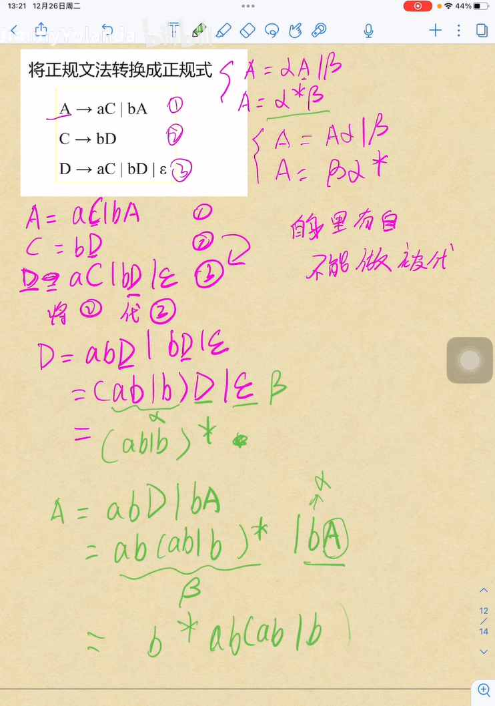

## 词法分析
* 从正规式到正规集，即枚举所有情况成为一个集合
* DFA与NFA的主要区别
  * DFA任何状态都没有ε转换，即没有任何状态可以不进行输入符号的匹配就直接进入下一个状态；
  * DFA对任何状态s和任何输入符号a，最多只有一条标记为a的边离开s，即转换函数δ：S x Σ $\rightarrow$ S是一个单值部分函数。
  * DFA的初态唯一，NFA的初态为一集合。
* 从NFA转换为DFA:
  1. 对状态图进行改造
  2. 进行确定化，求$\epsilon-clousure(I)$，构造状态转换表得到DFA
  3. 最后进行最小化得到状态数最少的DFA
* 二义性文法：L(G)的某个句子对应不只一个最左/最右推导
* 无二义性文法：该文法所产生的每一个句子都仅有一颗语法树。
* 短语：每棵子树的叶子
* 直接短语：每棵直接子树的叶子
* 句柄：某句型的最左直接短语（即规范分析中最先被规约的子串）
* 素短语：至少包含一个终结符且不包含更小素短语的短语

**正规文法->正规式**
