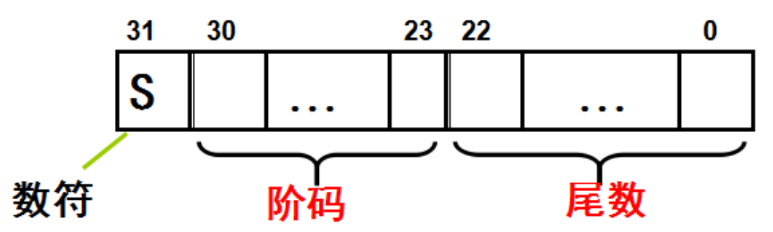
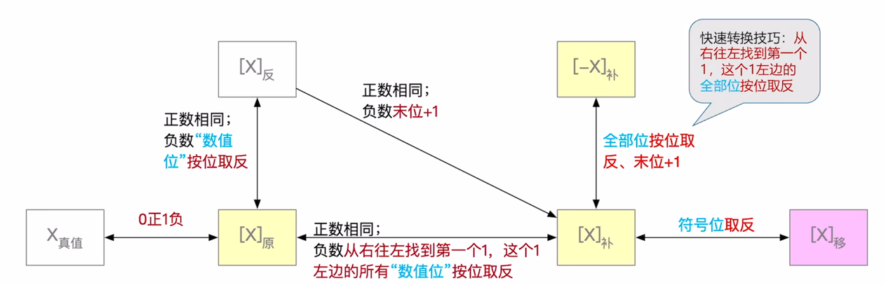
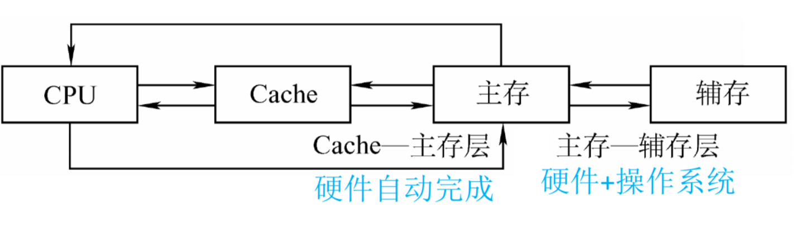
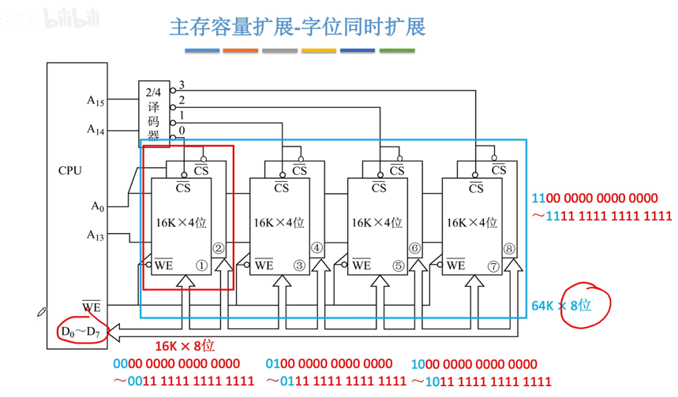
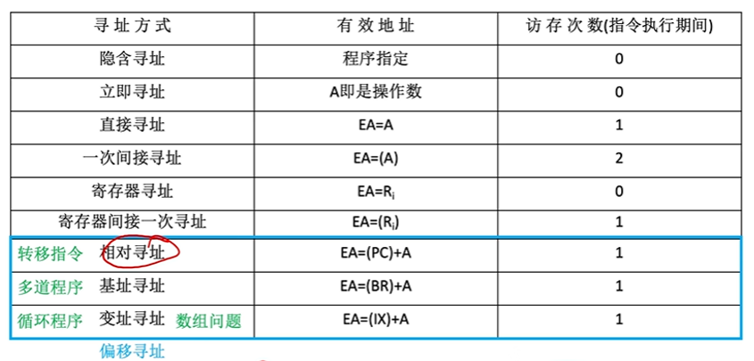
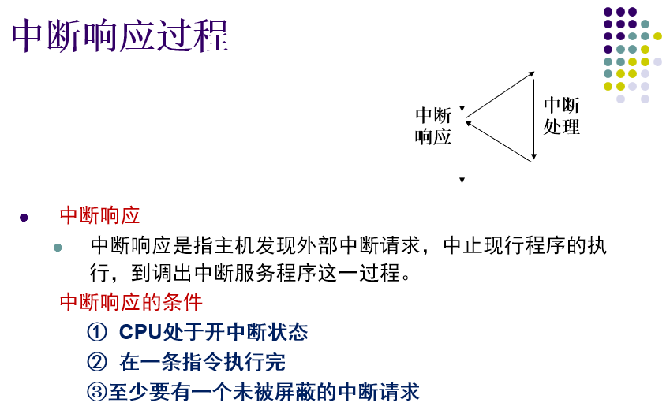
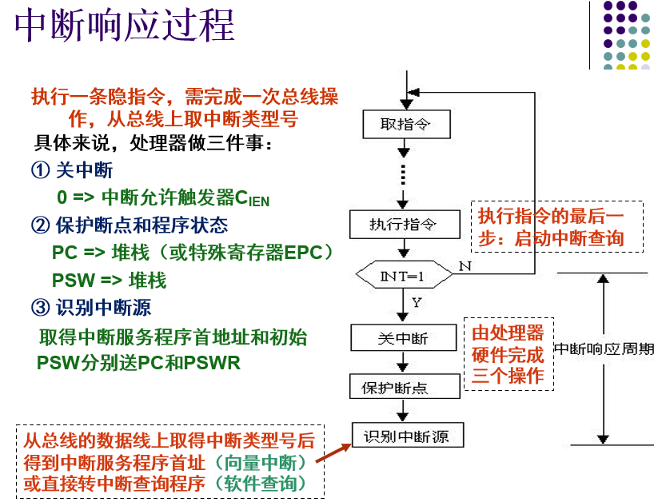
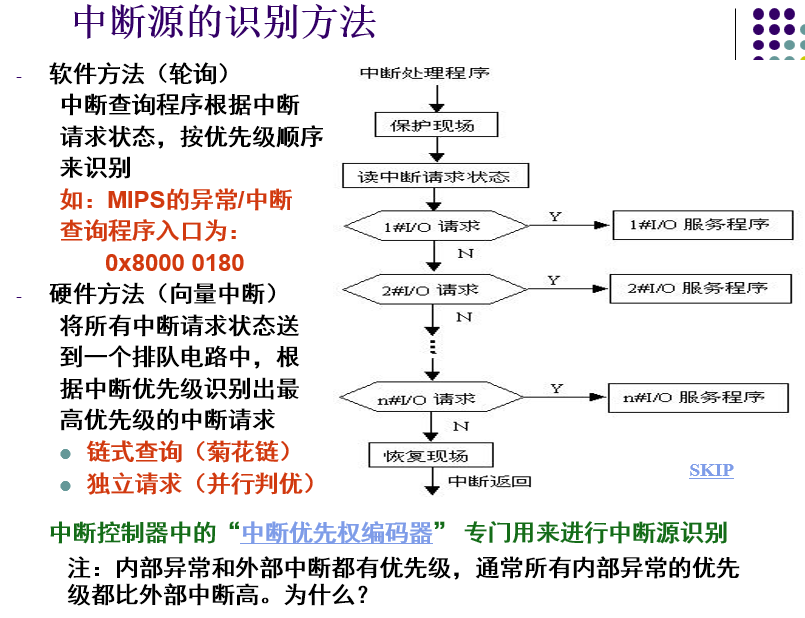
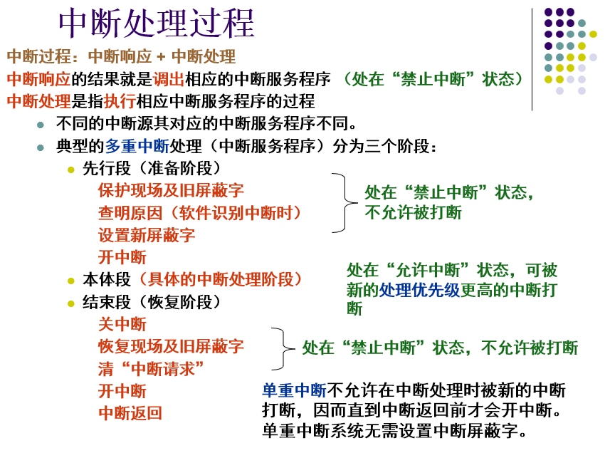

## 现代计算机的结构
**硬件**
* 主机
  * CPU
    * 运算器
    * 控制器
  * 主存
* I/O设备
  * 辅存
  * 输入设备
  * 输出设备
* 存储器
  * 主存
  * 辅存 

## 计算机系统概论
**计算机系统的层次结构**
* 第1级 微程序设计级（或逻辑电路级） - 直接由硬件执行
* 第2级 一般机器级 - 微程序
* 第3级 操作系统级 - 操作系统
* 第4级 汇编语言级 - 汇编程序
* 第5级 高级语言级 - 编译程序

## 运算方法和运算器
> 移码和补码互为相反数（仅符号位相反）
> 原码$\rightarrow$补码：取反+1
> 移码的机器数大小可以代表真值大小
> 一个负整数用原码、补码、反码表示时，符号位固定为1

> IEEE标准中 32位短浮点数(阶码：E=e+127  尾数：M)
> 
> 64位长浮点数S为1位，E为11位，M为52位
> 规格化的32位浮点数x的真值表示为 x = $ (-1)^S * (1.M) * 2^{E-127} $

> 补码加法公式：$[x]_补 + [y]_补 = [x+y]_补 $ &emsp; $ (mod $ &emsp;$2^{n+1})$
> 补码减法公式：$[x-y]_补=[x]_补-[y]_补=[x]_补+[-y]_补$
> 即 $[-y]_补=-[y]_补$ 
> **注:** 从$[y]_补求[-y]_补$的法则为：
> &emsp;对 $[y]_补$ 包括符号位"求反且最末位加1"，即可得到 $[-y]_补$
> 

> 浮点数加法、减法运算
> &emsp; 设$x = 2^{E_x}·M_x$，&emsp;$y=2^{E_y}·M_y$
> 运算规则:
> &emsp; $z = x\pm y=(M_x2^{E_x-E_y}\pm M_y)2^{E_y}$ &emsp;&emsp;$E_x\leq E_y$
> 计算步骤
> 1. 小阶向大阶对齐
> 2. 尾数相加
> 3. 规格化 **(至小数点第一位与符号位不同(非IEEE标准))**
> 4. 检查上下溢
> 5. 舍入操作(就近舍入、朝0舍入、朝$\pm\infty$舍入)

## 存储系统
> **局部性原理**：在某一段时间内频繁访问某一局部的存储器地址空间，而对此范围以外的地址空间很少访问的现象。
> &emsp;&emsp;**时间局部性**：最近被访问的信息可能还要被访问。
> &emsp;&emsp;**空间局部性**：最近被访问的信息邻近地址的信息也可能被访问。

> 主存——辅存(外存)：解决了主存容量不够的问题。
> Cache——主存：解决了主存与CPU之间速度不匹配的问题。
> 
> **注！CPU不能直接访问辅存(外存储器)，其信息必须先调入内存储器(主存)才能由CPU处理！内存包括主存以及cache(高速缓冲存储器)。**
>

> 机器字：计算机一次能直接处理的二进制数据的位数
> 存储容量 = (机器)字数x(机器)字长 &emsp; 如512K X 1B &emsp;(1Byte = 8bit)
> 地址线位数 = $log_2字数$
> 数据线位数 = 字长
> 存取时间 = 一趟火车运行时间
> 存储周期 = 发车周期
> 设系统的总线宽度为W，则存储器带宽 = W/存储周期(bit/s)

>主存容量扩展-字位同时扩展(需要先进行位扩展，再进行字扩展)A0 ~ A13为地址线(因为16k为2的14次方)，A14 ~ A15为片选线， $\overline{WE}$即Write enable允许写入
>

>&emsp;&emsp;**cache的基本工作原理**：在CPU和主存之间增加一层缓存，用于存储最近频繁使用的数据和指令，以提高计算机系统的运行速度。

&emsp;&emsp;**cache的地址映射是指将主存地址映射到cache地址的过程。常见的地址映射方式有直接映射、全相联映射和组相联映射。**

>&emsp;&emsp;**直接映射**是将主存地址划分为若干个块，每个块对应一个cache行，主存地址的低位用于表示块内偏移量，高位用于表示块号。当CPU访问主存时，根据主存地址的高位可以确定对应的cache行，然后再根据低位确定cache中的偏移量。直接映射的优点是实现简单，但容易出现冲突，导致性能下降。

>&emsp;&emsp;**全相联映射**是将主存地址和cache地址一一映射，每个cache行可以存储任意主存地址的数据。当CPU访问主存时，需要在cache中进行全局搜索，找到对应的cache行。全相联映射的优点是能够有效避免冲突，但实现复杂，成本较高。

>&emsp;&emsp;**组相联映射**是将cache划分为若干个组，每个组包含若干个cache行，主存地址的高位用于表示组号，低位用于表示块内偏移量。当CPU访问主存时，需要先确定对应的组，然后在该组中进行搜索，找到对应的cache行。组相联映射既能够有效避免冲突，又能够实现较简单的硬件设计。

> 指令寻址：顺序寻址、跳跃寻址
> 操作数寻址：
> 
> **注：取出当前指令后，PC会指向下一条指令，相对寻址是相对于下一条指令的偏移！**
## 操作数寻址
&emsp;&emsp;**操作数寻址方式是用来指定操作数在内存中的位置的方式。常见的寻址方式包括以下几种：**
1. **直接寻址**

&emsp;&emsp;直接寻址是指指令中直接给出操作数在内存中的地址。这种寻址方式简单、快速，但是只能访问固定的内存地址，不适用于动态分配内存的应用。

2. **立即寻址**

&emsp;&emsp;立即寻址是指指令中直接给出操作数的值。这种寻址方式适用于操作数比较小的情况，但是不适用于大量数据的处理。

3. **寄存器寻址**

&emsp;&emsp;寄存器寻址是指指令中给出操作数所在的寄存器编号。这种寻址方式速度快，适用于需要频繁访问的数据，但是寄存器数量有限。

4. **间接寻址**

&emsp;&emsp;间接寻址是指指令中给出操作数所在内存单元的地址，操作数存储在该内存单元中。这种寻址方式适用于动态分配内存的应用，但是访问速度较慢。

5. **寄存器间接寻址**

&emsp;&emsp;寄存器间接寻址是指指令中给出一个寄存器编号，该寄存器中存储着操作数所在内存单元的地址。这种寻址方式适用于需要频繁访问的数据，但是寄存器数量有限。

6. **基址寻址**

&emsp;&emsp;基址寻址是指指令中给出操作数相对于基地址的偏移量，操作数存储在基地址加上偏移量的内存单元中。这种寻址方式适用于程序中存在许多相对地址的情况。

7. **变址寻址**

&emsp;&emsp;变址寻址是指指令中给出操作数相对于变址寄存器的偏移量，操作数存储在变址寄存器加上偏移量的内存单元中。这种寻址方式适用于需要动态计算地址的情况。

&emsp;&emsp;总的来说，不同的寻址方式各有优缺点，需要根据具体应用场景选择合适的寻址方式。在实际应用中，通常采用组合寻址的方式来访问内存中的数据。
## 指令寻址

&emsp;&emsp;**指令寻址方式是指计算机在执行指令时确定下一条指令的位置的方式，常见的指令寻址方式包括以下几种：**

1. **顺序寻址**

&emsp;&emsp;顺序寻址是指按照指令在内存中的顺序依次执行。这种寻址方式简单、直观，但是不适用于需要跳跃执行的程序。

2. **跳跃寻址**

&emsp;&emsp;跳跃寻址是指在指令中给出跳转到另一个地址执行的指令。跳跃寻址可以实现程序的非顺序执行，适用于需要根据条件跳转执行的程序。

3. **子程序调用寻址**

&emsp;&emsp;子程序调用寻址是指在指令中给出跳转到子程序执行的指令，并在跳转前将返回地址保存在指定位置。子程序调用寻址可以实现程序的模块化设计，适用于需要重复执行的程序。

4. **中断寻址**

&emsp;&emsp;中断寻址是指在中断事件发生时，跳转到中断处理程序执行的指令。中断寻址可以实现计算机的并发处理，适用于需要处理多个任务的程序。

&emsp;&emsp;总的来说，不同的指令寻址方式各有优缺点，需要根据具体应用场景选择合适的寻址方式。在实际应用中，通常采用组合寻址的方式来确定下一条指令的位置。
## 中央处理器
$$CPU的功能\begin{cases}
指令控制——程序的顺序控制 \\
操作控制——管理并产生由内存取出的每条指令的操作信号\\
时间控制——对各种操作实施时间上的定时\\
数据加工——对数据进行算术运算和逻辑运算处理
\end{cases}$$

CPU（中央处理器）是计算机的核心部件，它主要由以下几个组成部分组成：
1. **控制单元（Control Unit，CU）**：负责控制CPU内部各部件的工作，包括指令的解码、执行和数据传输等。
2. **算术逻辑单元（Arithmetic Logic Unit，ALU）**：负责进行计算和逻辑运算，包括加、减、乘、除、与、或、非、移位等操作。
3. **寄存器（Register）**：用于暂时存储数据和指令，包括通用寄存器、指令寄存器、程序计数器等。
4. **缓存（Cache）**：作为CPU和内存之间的缓冲区，提高了数据传输速度。
5. **总线（Bus）**：用于连接CPU和其他部件之间的数据传输，包括地址总线、数据总线和控制总线等。
6. **时钟（Clock）**：用于控制CPU内部各部件的工作节奏，保证计算机系统的同步性和稳定性

**CPU中主要的寄存器：**
1. 数据缓冲寄存器(DR)
2. 指令寄存器(IR)
3. 程序计数器(PC)
4. 数据地址寄存器(AR)
5. 通用寄存器
6. 程序状态字寄存器(PSWR)

&emsp;&emsp;**注！在计算机组成原理中，MDR和DR（数据寄存器）是两个不同的概念。MDR是存储器数据寄存器（Memory Data Register）的缩写，它是CPU和主存之间数据传输的缓存寄存器，用于存储从主存中读出或写入主存的数据。而DR是数据寄存器（Data Register）的缩写，是CPU内部的寄存器之一，用于存储CPU执行指令时需要的数据。两者的作用和使用场景不同，因此是两个不同的概念。**

## 数据通路
&emsp;&emsp;数据通路是计算机中的一种硬件结构，是许多**寄存器**之间传送信息的通路，用于执行指令并处理数据。数据通路的主要功能是将指令中的操作码和操作数转换成实际的操作，并将操作结果存储到指定的寄存器或内存中。**数据通路的执行过程**可以分为以下几个阶段：

1. **取指阶段**（Instruction Fetch）：从内存中读取指令，并将指令存储到指令寄存器中。
2. **译码阶段**（Instruction Decode）：对指令进行译码，确定指令的操作类型和操作数，并将结果存储到相应的寄存器中。
3. **执行阶段**（Execute）：根据指令的操作类型和操作数，执行相应的操作，并将操作结果存储到指定的寄存器或内存中。
4. **存储阶段**（Memory Access）：如果指令需要访问内存，则从内存中读取或写入数据，并将数据存储到指定的寄存器或内存中。
5. **写回阶段**（Write Back）：将执行结果存储到指定的寄存器或内存中。

&emsp;&emsp;在数据通路中，指令的执行过程是由控制单元控制的。控制单元根据指令的操作类型和操作数，生成相应的控制信号，控制数据通路中的各个部件进行相应的操作。数据通路中的各个部件包括寄存器、ALU、存储器等。在指令执行过程中，数据通过数据总线在各个部件之间传输。指令执行完毕后，控制单元将控制信号置为初始状态，等待下一条指令的执行。

**微程序控制器**
&emsp;&emsp;是一种基于微程序的控制器，它的主要作用是控制计算机的指令执行过程。微程序控制器的原理如下：

1. **微程序存储器**：存储了一系列微指令，每个微指令对应一个操作，如取指令、译码、执行等。这些微指令通过微指令计数器按照一定的顺序被读取出来。

2. **微指令译码器**：用于对微指令进行译码，将微指令的控制信号转换成相应的操作。

3. **控制信号发生器**：根据微指令译码器输出的控制信号，生成相应的控制信号，控制计算机的指令执行过程。

4. **微指令计数器**：用于存储当前正在执行的微指令的地址，并控制微程序存储器中下一条微指令的读取。

**微程序控制器的工作过程如下：**
1. 当计算机执行一条指令时，控制器从微程序存储器中读取相应的微指令。

2. 微指令译码器将微指令中的控制信号译码成相应的操作。

3. 控制信号发生器根据微指令译码器输出的控制信号，生成相应的控制信号，控制计算机的指令执行过程。

4. 当微指令执行完毕后，微指令计数器控制微程序存储器中下一条微指令的读取。

&emsp;&emsp;微程序控制器的优点是可以实现指令的灵活扩展和修改，不需要对硬件进行大规模的改动，只需要修改微程序即可。同时，微程序控制器的实现也比较简单，易于设计和实现。但是，微程序控制器的缺点是速度较慢，需要较多的存储空间。

## 总线系统
&emsp;&emsp;**总线**是计算机内部的一种通信机制，用于连接计算机中的各个部件，包括CPU、内存、IO设备等，**使它们能够相互通信和交换数据**。总线可以分为以下几类：
1. **地址总线**：用于传输CPU发出的内存地址信号，指示内存中需要读取或写入的数据的位置。地址总线的宽度决定了计算机可以寻址的内存空间大小。

2. **数据总线**：用于传输CPU和内存或IO设备之间的数据。数据总线的宽度决定了计算机可以一次性传输的数据位数。

3. **控制总线**：用于传输CPU发出的控制信号，控制内存或IO设备的读写操作，以及计算机的其他操作。控制总线包括读写控制信号、时序控制信号、中断控制信号等。

总线的分类还可以**根据其传输数据的方式**来分为以下两类：

1. **并行总线**：指一次可以传输多个数据位的总线，数据位数与总线宽度相等。并行总线的优点是传输速度快，但需要较多的物理信道，限制了总线的长度和复杂度。

2. **串行总线**：指一次只能传输一个数据位的总线，数据位数远小于总线宽度。串行总线的优点是物理信道数量少，可以实现较长的总线长度和高速的数据传输。

总线还可以被分为**外部总线和内部总线**
1. **外部总线**是计算机系统中连接CPU和外部设备的总线，例如硬盘、光驱、USB接口、显示器等。它们通过外部总线与CPU进行通信，以便进行数据传输和控制。外部总线通常包括数据总线、地址总线和控制总线。数据总线传输数据，地址总线传输内存地址或I/O端口地址，控制总线传输控制信号。

2. **内部总线**是计算机系统中连接CPU和内部组件的总线，例如内存、缓存、总线控制器等。它们通过内部总线与CPU进行通信，以便进行数据传输和控制。内部总线通常包括数据总线、地址总线和控制总线。数据总线传输数据，地址总线传输内存地址或I/O端口地址，控制总线传输控制信号。

总之，**外部总线和内部总线**都是计算机系统中的总线，只是连接的设备不同。外部总线用于连接CPU和外部设备，内部总线用于连接CPU和内部组件。

## 进位计数制和数据编码
&emsp;&emsp; 它们都是数字处理中的重要概念，有一些相似之处，但也有一些不同之处。下面是它们的特点比较：
1. 进位计数制

&emsp;&emsp;进位计数制是一种计数方法，它使用一定的进位规则来表示数字。常见的进位计数制有二进制、八进制、十进制和十六进制等。进位计数制的特点如下：

- 进位规则简单，易于理解和实现。
- 每个进位计数制都有自己的进位规则和表示方法，因此不同进位计数制之间的数字不可直接比较。
- 二进制是计算机中最常用的进位计数制，可以直接表示逻辑运算和二进制数据。

2. 数据编码

&emsp;&emsp;数据编码是将数据转换为一定的编码格式，以便计算机或其他设备进行处理和存储。常见的数据编码方法有ASCII码、Unicode、UTF-8等。数据编码的特点如下：

- 不同的数据编码方法可以表示不同的字符集和语言。
- 数据编码可以压缩数据，减少存储和传输的空间和时间。
- 数据编码可以保证数据的安全性，防止数据被非法篡改或窃取。

&emsp;&emsp;总的来说，进位计数制和数据编码都是数字处理中的重要概念，它们有着不同的特点和应用场景。进位计数制主要用于数字的计数和表示，而数据编码主要用于数据的存储和传输。

## 存储器的层次结构通常包括以下几层：

1. 寄存器

&emsp;&emsp;寄存器是最快速的存储器，通常被集成在CPU内部，用于存储临时数据和指令。寄存器速度极快，但容量有限。

2. 高速缓存Cache

&emsp;&emsp;高速缓存是位于CPU和主存之间的存储器，用于存储最近使用的数据和指令。高速缓存速度比主存快，但容量较小。

3. 主存储器

&emsp;&emsp;主存储器是计算机中最主要的存储器，用于存储程序和数据。主存储器速度比磁盘等外部存储器快，但容量相对较小。

4. 辅助存储器

&emsp;&emsp;辅助存储器包括硬盘、光盘、闪存等，用于长期存储程序和数据。辅助存储器容量大，但速度比主存储器慢。

## 存储器的组成原理包括以下几个方面：

1. 存储单元

&emsp;&emsp;存储单元是存储器的最小单元，用于存储一个二进制位。存储单元通常由一个触发器或晶体管等构成。

2. 存储地址

&emsp;&emsp;存储地址是用于访问存储器中特定存储单元的编号。存储地址通常由一个或多个二进制数表示。

3. 存储器芯片

&emsp;&emsp;存储器芯片是存储器的核心部件，通常由许多存储单元组成。存储器芯片的类型包括SRAM、DRAM、ROM等。

4. 存储器控制器

&emsp;&emsp;存储器控制器是用于控制存储器读写操作的电路。存储器控制器通常由地址译码器、时序控制器等构成。

&emsp;&emsp;总的来说，存储器的层次结构和组成原理都是计算机系统中非常重要的概念，对于理解计算机的存储器原理和性能优化都有着重要的作用。

## 指令操作码
&emsp;&emsp;指令操作码是指令中用来表示操作类型的二进制码。指令操作码的编码方式可以分为以下几种：

1. 定长编码

&emsp;&emsp;定长编码是指所有指令的操作码长度相同。这种编码方式简单、易于实现，但是由于操作码长度固定，会浪费一些编码空间。

2. 变长编码

&emsp;&emsp;变长编码是指不同指令的操作码长度不同。这种编码方式可以最大限度地利用编码空间，但是编码和解码复杂度较高。

3. 前缀编码

&emsp;&emsp;前缀编码是指操作码中的一部分用于表示指令的前缀，另一部分用于表示操作类型。这种编码方式可以减少操作码的长度，但是需要额外的前缀解码电路。

4. 扩展编码

&emsp;&emsp;扩展编码是指操作码中的一部分用于表示操作类型，另一部分用于表示操作数的数量和长度。这种编码方式可以支持更多的操作类型和数据类型，但是编码和解码复杂度较高。

&emsp;&emsp;总的来说，不同的指令操作码编码方式各有优缺点，需要根据具体应用场景选择合适的编码方式。在实际应用中，通常采用定长编码或前缀编码的方式来表示指令操作码。

## I/O接口的功能及其结构
&emsp;&emsp;I/O（Input/Output）接口是计算机系统中用于连接输入输出设备的接口，其主要功能是实现计算机与外部设备之间的数据传输和控制信号传递。I/O接口通常由两部分组成：接口电路和控制器。

1. 接口电路

&emsp;&emsp;接口电路是I/O接口的物理部分，用于将计算机的信号转化为外部设备可以识别的信号，同时将外部设备的信号转化为计算机可以识别的信号。接口电路通常包括以下几个部分：

- 数据缓冲区：用于暂存输入输出数据，以便于数据传输和处理。
- 数据格式转换电路：用于将计算机内部的数据格式转换为外部设备可以接受的数据格式。
- 时序控制电路：用于控制数据传输的时序和时钟信号。
- 接口逻辑电路：用于处理输入输出控制信号和数据传输信号。

2. 控制器

&emsp;&emsp;控制器是I/O接口的逻辑部分，用于实现对外部设备的控制和数据传输。控制器通常包括以下几个部分：

- 接口控制逻辑：用于控制接口电路的工作和数据传输的流程。
- 数据传输控制逻辑：用于控制数据的传输和处理，包括数据的读取、写入、传输速率等。
- 设备控制逻辑：用于控制外部设备的工作状态和传输数据的方式，包括设备的启动、停止、复位等操作。

&emsp;&emsp;总的来说，I/O接口的功能主要是实现计算机与外部设备之间的数据传输和控制信号传递，其结构主要由接口电路和控制器两部分组成。I/O接口的设计和实现对于计算机系统的性能和可靠性具有重要的影响。

## 外围设备的信息交换方式及区别特点
1. **程序查询方式**：CPU通过轮询的方式查询外围设备是否有数据需要传输。在程序查询方式下，CPU需要不断地检查外围设备状态，这会占用大量的CPU时间，效率较低。

2. **程序中断方式**：外围设备在完成数据传输后，向CPU发送一个中断信号，通知CPU有数据需要处理。CPU接收到中断信号后，暂停当前任务，转而去处理中断服务程序。中断服务程序完成后，CPU再返回原来的任务。程序中断方式可以减少CPU占用时间，提高系统效率。

3. **DMA方式**：DMA（Direct Memory Access，直接内存访问）是一种无需CPU介入的数据传输方式。在DMA方式下，外围设备通过DMA控制器直接访问内存，将数据传输到指定的内存地址中。DMA方式可以大大减少CPU的负担，提高数据传输速度。

4. **通道方式**：通道是一种专门的硬件设备，用于管理外围设备和内存之间的数据传输。通道可以独立于CPU工作，通过DMA方式进行数据传输。通道方式可以同时处理多个外围设备的数据传输请求，提高系统效率。通道方式适用于大型计算机和中小型计算机系统。

&emsp;&emsp;总之，程序查询方式和程序中断方式是CPU介入的数据传输方式，而DMA方式和通道方式是无需CPU介入的数据传输方式。每种方式都有其适用的场景和优缺点，需要根据具体情况进行选择。

## 程序中断的处理过程
&emsp;&emsp;程序中断是指在程序执行过程中，由于某种原因（如硬件故障、操作系统调度等）导致程序的执行被中断，转而执行其他的程序或处理程序。程序中断的处理过程通常包括以下几个步骤：

1. **中断响应**

&emsp;&emsp;当发生中断时，处理器会立即停止当前正在执行的程序，保存当前程序的状态（如程序计数器、寄存器等），并跳转到中断处理程序的入口地址。中断响应的时间很短，通常只有几个时钟周期。

2. **中断处理**

&emsp;&emsp;中断处理程序是用来处理中断的程序，通常由操作系统提供。中断处理程序需要根据中断类型进行相应的处理，如读取输入设备的数据、更新系统时间、处理异常等。中断处理程序执行完毕后，会将控制权交还给被中断的程序。

3. **中断返回**

&emsp;&emsp;当中断处理程序执行完毕后，需要将保存的状态恢复回来，以便于被中断的程序可以继续执行。中断返回的过程通常包括以下几个步骤：恢复程序计数器、恢复寄存器、恢复堆栈指针等。最后，处理器会跳转回被中断的程序继续执行。

&emsp;&emsp;总的来说，程序中断的处理过程是一个比较复杂的过程，需要涉及到处理器的状态保存和恢复、中断处理程序的执行和中断返回等多个步骤。在实际应用中，需要根据具体的中断类型和应用场景进行相应的处理。

