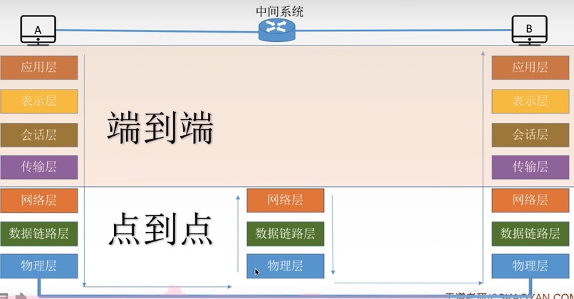
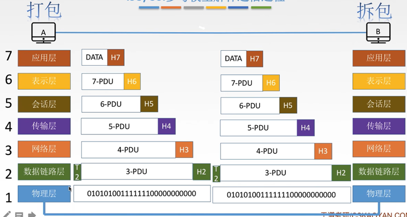
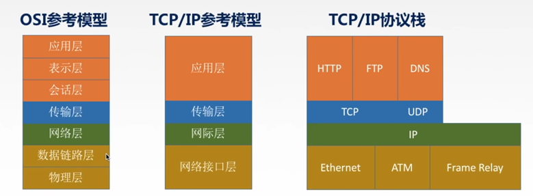
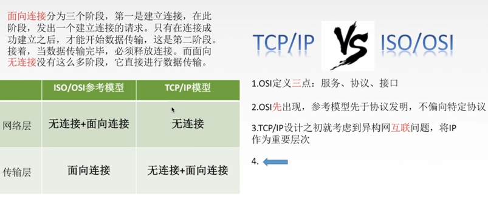
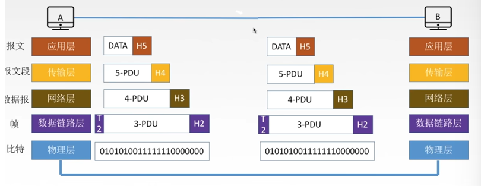
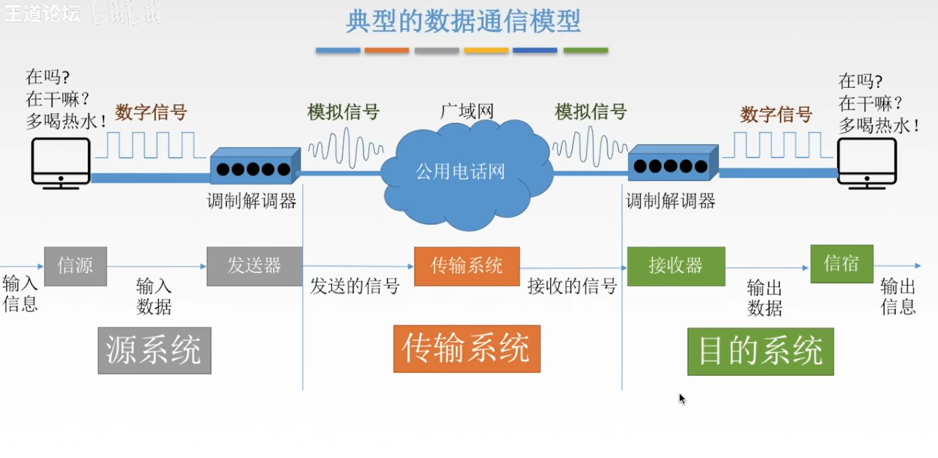

# Chapter 1
* 计网体系结构
  * 计算机网络概述
    * 概念、组成、功能、分类
    * 标准化工作及相关组织
    * **性能指标**
  * 体系结构&参考模型
    * 分层结构
    * 协议、接口、服务
    * **ISO/OSI模型**
    * **TCP/IP模型**

**计算机网络的概念**
* 计算机网络：是一个将分散的、具有独立功能的**计算机系统**，通过**通信设备**与路线连接起来，由功能完善的**软件**实现**资源共享**和**信息传递**的系统。
* 计算机网络是**互连**的、**自治**的计算机集合
* 互连-通过通信链路互联互通
* 自治-无主从关系

**计算机网络的功能**
1. 数据通信
2. 资源共享
* 同一个计算机网络上的其他计算机可使用某台计算机的计算机资源的行为，可共享**硬件、软件、数据**
3. 分布式处理
* 多台计算机各自承担同一工作任务的不同部分（如Hadoop平台）
4. 提高可靠性
5. 负载均衡

**计算机网络的组成**
1. 组成部分：硬件、软件、协议（一系列规则和约定的集合）
2. 工作方式
* 边缘部分-用户直接使用
  * C/S方式
  * P2P方式
* 核心部分-为边缘部分服务
3. 功能组成
* 通信子网-实现数据通信，是实现资源共享功能的设备和软件的集合
  * 应用层
  * 表示层
  * 会话层
* 介于通信子网和资源子网之间的是 传输层
* 资源子网-实现资源共享/数据处理，是各种传输质、通信设备、相应的网络协议组成
  * 网络层（路由器）
  * 数据链路层（交换机，网桥）
  * 物理层（集线器，中继器）

**计算机网络的分类**
1. 按分布范围分：广域网WAN（交互技术）、城域网MAN、局域网LAN（广播技术）、个人区域网PAN
2. 按使用者分
* 公用网（中国电信）
* 专用网（军队，政府）
3. 按交换技术分：电路交换、报文交换、分组交换
4. 按拓扑结构分：总线型、星型、环形、网状型（常用于广域网）
5. 按传输技术分
* 广播式网络：共享公共通信信道
* 点对点网络：使用分组存储转发和路由选择机制

**速率**
* 速率即**数据率**或称**数据传输率**或**比特率**
* 比特 1/0 位
* 连接再计算机网络上的**主机**在数字信道上传送数据**位数的速率**
* 单位是b/s, kb/s, Mb/s, Gb/s, Tb/s

**带宽**
1. 带宽原本指某个信号具有的频带宽度，即最高频率与最低频率之差，单位是赫兹（Hz）
2. 计算机网络中，带宽用于表示网络的通信线路传送数据的能力，通常是指单位时间内从网络中的某一点到另一点所能通过的“**最高数据率**”。单位是比特每秒，b/s, kb/s, Mb/s, Gb/s。
即**网络设备所支持的最高速度**

**速率是链路上bit的传播速度，链路带宽是该链路支持的最大速率，如车速可以300km/h但不同路段都有限速**

**吞吐量**
* 表示在**单位时间**内通过**某个网络（或信道、接口）**的数据量。单位b/s, kb/s, Mb/s等。吞吐量受网络的带宽或网络的额定速率限制。

**时延**
* 指数据（报文/分组/比特流）从网络（或链路）的一端传送到另一端所需的时间。也叫 延迟 或 迟延。单位是s。
  * 发送时延（传输时延）：数据长度/信道带宽（发送速率）
  * 传播时延（取决于电磁波传播速度和链路长度）：信道长度/电磁波在信道上的传播速率
  * 排队时延（等待输出、入链路可用）
  * 处理时延（检错找出口）

**时延带宽积**
* 时延带宽积（bit） = 传播时延（s） x 带宽（b/s）
* 时延带宽积又称为以**比特为单位的链路长度**。即“某段链路现在有多少比特”

**往返时延RTT**
* 从发送方发送数据开始，到发送方收到接收方的确认（接收方收到数据后立即发送确认），总共经历的时延。
* RTT越大，在收到确认之前，可以放松的数据越多
* RTT包括
  * 往返传播时延=传播时延 * 2
  * 末端处理时间

**利用率**
* 信道利用率 = 有数据通过时间/（有+无）数据通过时间
* 网络利用率 - 信道利用率加权平均值

**分层的基本原则**
1. 各层之间相互独立，每层只实现一种相对独立的功能。
2. 每层之间界面自然清晰，易于理解，相互交流尽可能的少。
3. 结构上可分割开。每层都采用最合适的技术来实现。
4. 保持下层对上层的独立性，上层单向使用下层提供的服务。

**分层结构相关概念**
1. 实体：第n层中活动元素称为**n层**实体。同一层的实体叫**对等实体**。
2. 协议：为进行网络中的**对等实体**数据交换而建立的规则、标准或约定成为网络协议。（水平）
* 语法：规定传输数据的格式
* 语义：规定所要完成的功能
* 同步：规定各种操作的顺序
3. 接口（访问服务点SAP）：上层使用下层服务的入口。
4. 服务：下层为相邻上层土工的功能调用。（垂直）
5. SDU服务数据单元：为完成用户所要求的功能而应传送的数据。
6. PCI协议控制信息：控制协议操作的信息。
7. PDU协议数据单元：对等层次之间传送的数据单位。
8. PCI + SDU = PDU

**概念总结**
* 网络体系结构是从**功能**上描述计算机网络结构。
* 计算机网络体系结构简称网络体系结构是**分层结构**
* 每层遵循某个/些**网络协议**以完成本层功能。
* **计算机网络体系结构**是计算机网络的**各层及其协议**的集合。
* 第n层在向n+1层提供服务时，此服务不仅包含第n层本身的功能，还包含由下层服务提供的功能。
* 仅仅在**相邻层间有接口**，且所提供服务的具体实现细节对上一层完全屏蔽。
* 体系结构是**抽象**的，而实现是指运行的一些软件和硬件。

**ISO/OSI参考模型**
1. 物理层
2. 数据链路层
3. 网络层
* 以上为通信子网（数据通信）
4. 传输层
5. 会话层
6. 表示层
7. 应用层
* 以上为资源子网（数据处理）

记忆口诀：**物联网淑慧试用（物链网输会示用）**

**ISO/OSI参考模型解释通信过程**

**应用层**
* 所有能和用户交互产生网络流量的程序
* 典型应用层服务：
  * 文件传输(FTP)
  * 电子邮件(SMTP)
  * 万维网(HTTP)
  * ......

**表示层**
* 用于处理在两个通信系统中交换信息的表达方式(语法和语义)
* 功能一：数据格式交换
* 功能二：数据加密解密
* 功能三：数据压缩和恢复
* 主要协议：JPEG、ASCII

**会话层**
* 向表示层实体/用户进程提供**建立连接**并在连接上**有序**地**传输**数据。这是会话，也是**建立同步**（SYN）
* 功能一：建立、管理、终止会话
* 功能二：使用效验点可使会话在通信失效时从**效验点/同步点**继续恢复通信，实现数据同比。（适用于传输大文件）
* 主要协议：ADSP、ASP

**传输层**
* 负责主机中**两个进程**的通信，即**端到端**的通信。传输单位是报文段或用户数据报。
* 功能一：可靠传输、不可靠传输
* 功能二：差错控制
* 功能三：流量控制
* 功能四：复用分用
* 复用：多个应用层进程可同时使用下面运输层的服务。
* 分用：运输层把收到的信息分别交付给上面应用层中相应的进程。
* 主要协议：TCP, UDP

**网络层**
* 主要任务是把**分组**从源端传到目的端，为分组交换网上的不同主机提供通信服务。网络层传输单位是**数据报**。
* 功能一：路由选择（最佳路径）
* 功能二：流量控制
* 功能三：差错控制
* 功能四：拥塞控制
* 若所有结点都来不及接受分组，而要丢弃大量分组的话，网络就处于拥塞状态。因此要采取一定措施，缓解这种拥塞。
* 主要协议：IP, IPX, ICMP, IGMP, ARP, RARP, OSPF

**数据链路层**
* 主要任务是把网络层传下来的数据报**组装成帧**。数据链路层/链路层的传输单位是**帧**。
* 功能一：成帧（定义帧的开始和结束）
* 功能二：差错控制 **帧错 + 位错**
* 功能三：流量控制
* 功能四：访问（接入）控制 **控制对信道的访问**
* 主要协议：SDLC, HDLC, PPP, STP

**物理层**
* 主要任务是在**物理媒体**上实现比特流的**透明传输**。物理层传输单位是**比特**。
* **透明传输**：指不管所传数据是什么样的比特组合，都应能够在链路上传送。
* 功能一：定义接口特性
* 功能二：定义传输模式（单工，半双工，双工）
* 功能三：定义传输速率
* 功能四：比特同步
* 功能五：比特编码
* 主要协议：Pj45、802.3

**OSI参考模型与TCP/IP参考模型**

* 相同点：
  * 都分层
  * 基于独立的协议栈的概念
  * 可以实现异构网络互联
* 不同点
  * 

**5层参考模型**
* 5层参考模型综合了OSI和TCP/IP的优点 FTP, SMTP, HTTP
* 应用层：支持各种网络应用 TCP, UDP
* 传输层：进程-进程的数据传输 IP, ICMP, OSPF
* 网络层：源主机到目的主机的数据分组路由与转发 Ethernet, PPP
* 数据链路层：把网络层传下来的数据报组装成帧
* 物理层：比特传输

**5层参考模型的数据封装与解封装**

**物理层接口特性**
* 物理层解决如何在连接各种计算机的传输媒体上**传输数据比特流**，而不是指具体的传输媒体。
* 物理层主要任务：确定与传输媒体接口有关的一些特性->定义标准
1. 机械特性：定义物理连接的特性，规定物理连接时所采用的规格、接口形状、引线数目、引脚数量和排列情况。
2. 电气特性：规定传输二进制位时，线路上信号的电压范围、阻抗匹配、传输速率和距离限制等。
3. 功能特性：指明某条线上出现的某一电平表示何种意义，接口部件的信号线的用途。
4. 规程特性：（过程特性）定义各条物理线路的工作规程和时许关系。

**典型的数据通信模型**

**数据通信相关术语**
* 通信的目的是传送消息（消息：语音，文字，图像，视频等）
* 数据data：传送信息的实体，通常是有意义的符号序列。
* 信号：
  * 数据的电气/电磁的表现，是数据在传输过程中的**存在形式**。
  * 数字信号/离散信号：代表消息的参数的取值是离散的。
  * 模拟信号/连续信号：代表消息的参数的取值是连续的。
* 信源：产生和发送数据的源头
* 信宿：接收数据的终点。
* 信道：信号的传输媒介。一般用于表示向某一个方向传送信息的介质，因此一条通信线路往往包含一条发送信道和一条接收信道。
* 信道按传输信号分:模拟信道（传送模拟信号）数字信道（传送数字信号）
* 信道按传输介质分：无线信道 有线信道

**数据传输方式**
* 串行传输：将表示一个字符的8位二进制数按由低位到高位的顺序依次发送。（速度慢，费用低，适合远距离）
* 并行传输：将表示一个字符的8位二进制数同时通过8条信道发送。（速度快，费用高，适合近距离）
* 同步传输：在同步传输的模式下，数据的传送是以一个数据区块位单位，因此同步传输又称为区块传输。在传送数据时，需先送出1个或多个同步字符，再送出整批的数据。
* 异步传输：异步传输将比特分成小组进行传送，小组可以是8位的1个字符或更长。发送方可以在任何时刻发送这些比特组，而接收方不知道他们会在什么时候到达。传送数据时，加一个字符起始位和一个字符终值位。

**码元**
* 码元是指用一个固定时长的信号波形（数字脉冲），代表不同离散数值的基本波形，是数字通信中数字信号的计量单位，这个时长内的信号成为k进制码元，而该时长称为码元宽度。
* 例如当码元离散状态有M（>2）个时，此时码元为M进制码元。
* 1码元可以**携带多个比特的信息量**。
* K进制码元--4进制码元$\rightarrow$码元的离散状态有4个$\rightarrow$ 4种高低不同的信号波形 00、01、10、11

**数字通信系统数据传输速率的两种表示方法**
* 速率也叫数据率，是指数据的传输速率，表示单位时间内传输的数据量。可以用码元传输速率和信息传输速率表示。
1. 码元传输速率（1s传输多少个码元）：别名码元速率，波形速率，调制速率，符号速率等，它表示单位时间内数字通信系统所传输的码元个数（也可称为脉冲个数或信号变化的次数），单位是**波特（Baud）**。1波特表示数字通信系统每秒传输一个码元。
2. 信息传输速率（1s传输多少个比特）：别名信息速率，比特率等，表示单位时间内数字通信系统传输的二进制码元个数（即比特数），单位是比特/秒（b/s）。
* 关系：若一个码元携带n bit信息量，则M Baud的码元传输速率所对应的信息传输速率为Mxn bit/s。

