**网络层**
* 主要任务是把**分组**从源端传到目的端，为分组交换网上的不同主机提供通信服务。网络层传输单位是**数据报**。
* 功能一：路由选择与分组转发（**最佳路径**）
* 功能二：异构网络互联
* 功能三：拥塞控制

**SDN**

**路由器功能**
* 转发：达到路由器**输入链路之一**的数据报如何转发到该路由器的**输出链路之一**。
* 路由选择：控制数据报沿着从源主机到目的主机的端到端路径中**路由器之间的路由方式**。

**数据平面**
* 数据平面执行的主要功能是**根据转发表进行转发**，这是路由器的本地动作。

**控制平面（SDN方法：Software-Defined Networking）**
* 控制平面（传统方法）：**控制平面从路由器物理上分离**。路由器仅实现转发，**远程控制器**计算和分发转发表以供每台路由器所使用。
* 具体方法：路由器通过交换包含转发表和其他路由器选择信息的报文与远程控制器通信。因为计算转发并与路由器交互的控制器是用软件实现的，所以网络是“软件定义的”。

**SDN控制平面**
1. SDN控制器：维护准确的网络状态信息（远程链路，交换机和主机的状态）；为运行在控制平面中的网络控制应用程序提供这些信息（逻辑集中，在多台服务器上实现）。
2. 网络控制应用程序：根据SDN控制器提供的方法，这些应用程序通过这些方法能够监视、编程和控制下面的网络设备。

**SDN控制器的三个层次：**
1. 对于网络控制应用程序的接口：
* SDN控制器通过“北向接口”与网络控制应用程序交互。该API允许网络控制应用程序在状态管理层之间读写网络状态。
2. 网络范围状态管理层：
* 由SDN控制平面作的最终控制决定，将要求控制器具有关网络的主机、链路等最新状态信息。
3. 通信层：
* SDN控制器与受控网络设备之间的通信（OpenFlow协议），包含“南向接口”。

**路由算法的分类：**
1. 静态路由算法（非自适应路由算法）：管理员手工配置路由信息。
2. 动态路由算法（自适应路由算法）：路由器间彼此交换信息，按照路由算法优化出路由表项。

**动态路由算法**
1. 全局性：链路状态路由算法（OSPF）所有路由器掌握完整的网络拓扑和链路费用信息。
2. 分散性：距离向量路由算法（RIP）路由器只掌握物理相连的邻居及链路费用。

**IP数据报格式：**
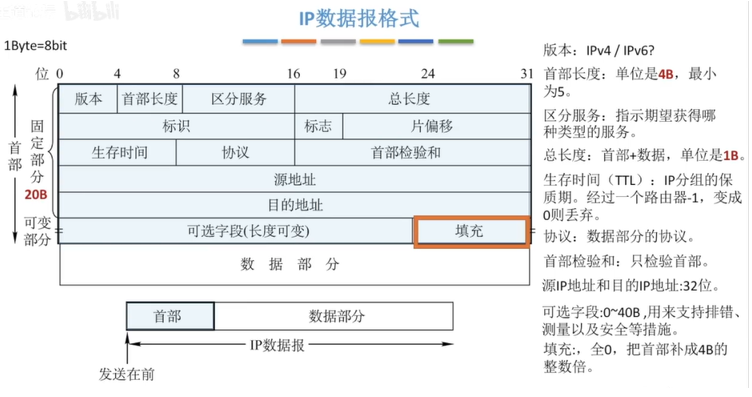
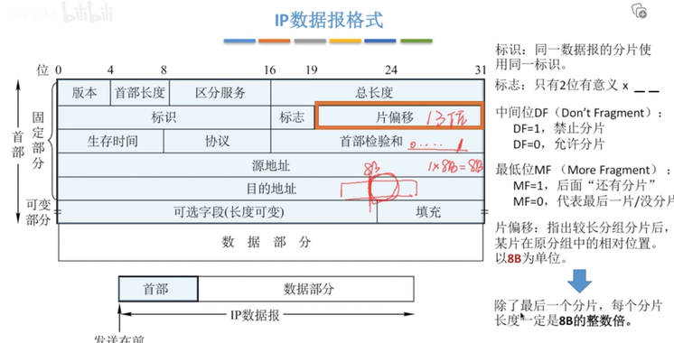
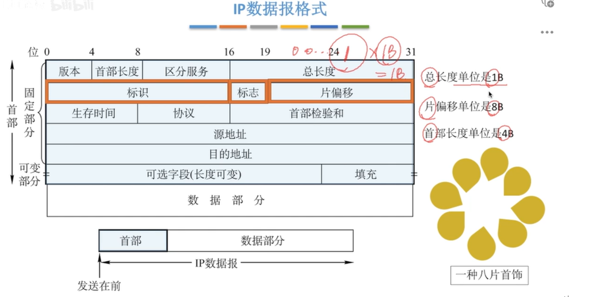

**IP数据报分片例题**

**ip地址分类**
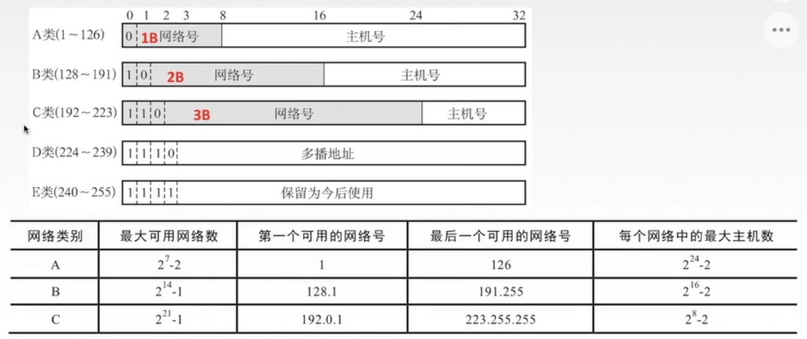

**特殊ip地址**
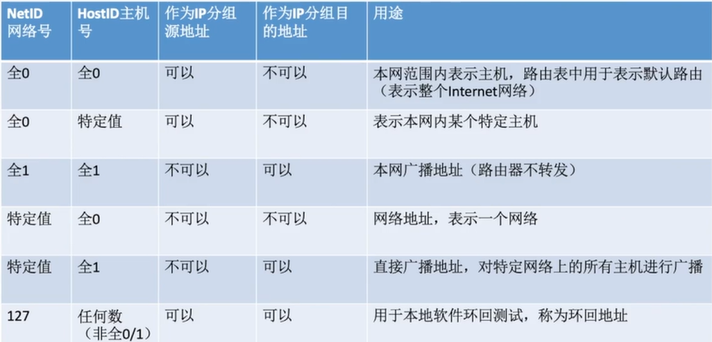

**网络地址转换NAT**
* 网络地址转换NAT（Network Address Translation）：在**专用网**连接到**因特网**的路由器上安装NAT软件，安装了NAT软件的路由器叫**NAT路由器**，它至少有一个有效的**外部全球ip地址。**
* 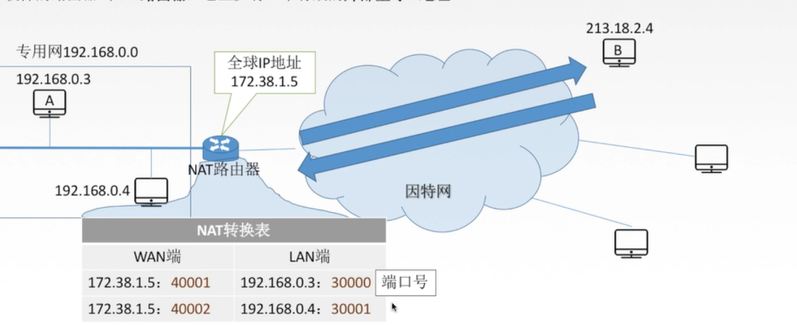

**子网划分**
* 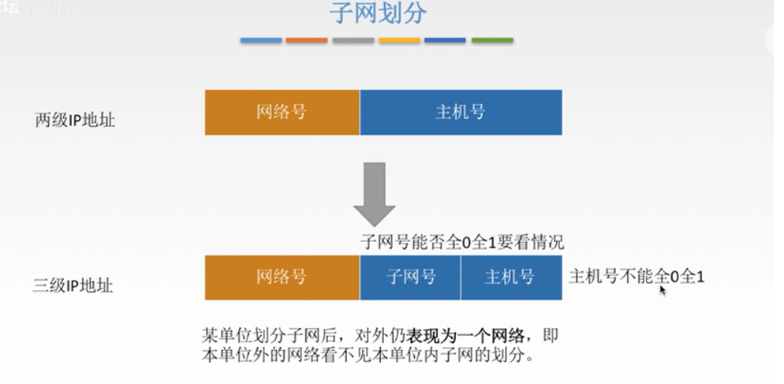

**子网掩码**
* 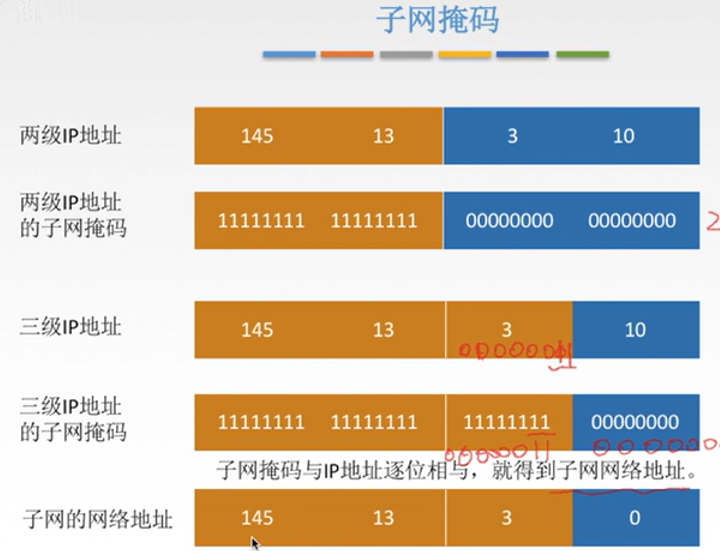

**使用子网时的分组转发**
* 路由表中包括：
1. 目的网络地址
2. 目的网络子网掩码
3. 下一跳地址
* 路由器转发分组的算法：
1. 提取目的IP地址
2. 是否直接交付
3. 特定主机路由
4. 检测路由表中有无路径
5. 默认路由0.0.0.0
6. 丢弃，报告转发分组出错

**无分类编址CIDR**
* 无分类域间路由选择CIDR：
1. 消除了传统的A类，B类，C类地址以及划分子网的概念。
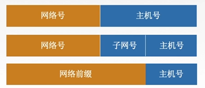
2. CIDR记法：IP地址后加上“/”，然后写上网络前缀（可以是任意长度）的位数。E.g. 128.14.32.0/20
3. 融合子网地址与子网掩码，方便子网划分：CIDR把网络前缀都相同的连续的IP地址组成一个“CIDR地址块”。例如128.14.35.7/20就说某CIDR地址块中的一个地址。
* 二进制：<u>10000000 &emsp; 00001110 0010</u>0011 &emsp; 00000111
* 最小地址：<u>10000000 &emsp; 00001110 0010</u>0000 &emsp; 00000000
* 即：128.14.32.0
* 最大地址：<u>10000000 &emsp; 00001110 0010</u>1111 &emsp; 11111111
* 即：128.14.47.255
* 地址块：128.14.32.0/20 “/20地址块”
* 地址掩码（子网掩码）：11111111 &emsp; 11111111 &emsp; 11110000 &emsp; 00000000

**发送数据的过程**
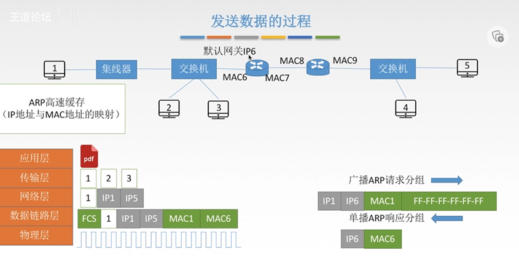

**ARP协议**
> 由于在实际网络的链路上传送数据帧时必须使用MAC地址，因此需要ARP协议：完成主机或路由器IP地址到MAC地址的映射。（解决下一跳走哪的问题）
* ARP协议使用过程：
> 检查**ARP高速缓存**，有对应表项则写入MAC帧，没有则用目的MAC地址为FF-FF-FF-FF-FF-FF的帧封装并广播ARP请求分组，**同一局域网中**所有主机都能收到该请求。目的主机收到请求后就会向源主机**单播一个ARP响应分组**，源主机收到后将此映射写入**ARP缓存**（10-20min更新一次）。
* ARP协议4种典型情况：
1. 主机A发给本网络上的主机B：用ARP找到主机B的硬件地址；
2. 主机A发给另一网络上的主机B：用ARP找到本网络上一个路由器（网关）的硬件地址；
3. 路由器发给本网络的主机A：用ARP找到主机A的硬件地址；
4. 路由器发给另一网络的主机B：用ARP找到本网络上的一个路由器的硬件地址。
* **ARP协议自动进行** 

**DHCP协议**
> 动态主机配置协议DHCP是**应用层**协议，使用**客户/服务器**方式，客户端和服务端通过**广播**方式进行交互，基于**UDP**。DHCP提供**即插即用**联网的机制，主机可以从服务器动态获取IP地址、子网掩码、默认网关、DNS服务器名称与IP地址，允许**地址重用**，支持**移动用户加入网络**，支持**在用地址续租**。
1. 主机广播DHCP**发现**报文————“有没有DHCP服务器呀？”
* 试图找到网络种的服务器，服务器获得一个IP地址。
2. DHCP服务器广播HDCP**提供**报文————“有！有！有！”
* 服务器拟分配给主机一个IP地址及相关配置，先到先得。
3. 主机广播DHCP**请求**报文————“我用你给我的IP地址吗？”
* 主机向服务器请求提供IP地址。
4. HDCP服务器广播DHCP**确认**报文————“用吧！”
* 正式将IP地址分配给主机
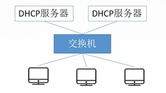

**TCP/IP协议栈**
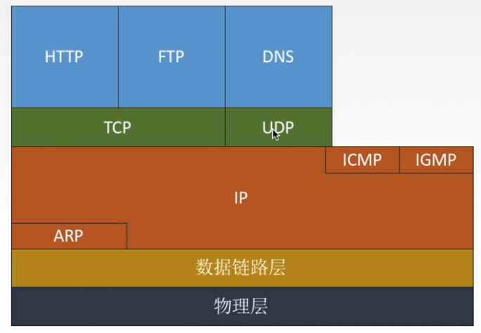

**ICMP差错报告报文（5种）**
1. 终点不可达：当路由器或主机不能交付数据报时就向源点发送终点不可达报文。（**无法交付**）
2. 源点抑制：**拥塞丢数据**（不考）
3. 时间超过：当路由器收到生存时间TTL=0的数据报时，除丢弃数据报外，还要向源点发送时间超过报文。当终点在预先规定的时间内不能收到一个数据报的全部数据报片时，就把已收到的数据报片都丢弃，并向源点发送时间超过报文。（**TTL=0**）
4. 参数问题：当路由器或目的主机收到的数据报的首部中有的字段的值不正确时，就丢弃该数据报，并向源点发送参数问题报文。（**首部字段有问题**）
5. 改变路由（重定向）：路由器把改变路由报文发送给主机，让主机知道下次应该将数据报发送给另外的路由器（可通过更好的路由）（**值得更好的路由**）

**ICMP差错报告数据字段**
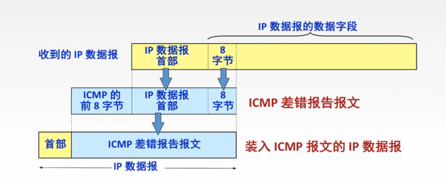

**不应发送ICMP差错报文的情况**
1. 对**ICMP差错报告报文**不再发送ICMP差错报告报文。
2. 对第一个分片的数据报片的所有**后续数据报片**都不发送ICMP差错报告报文。
3. 对具有**组播地址**的数据报都不发送ICMP差错报告报文。
4. 对具有**特殊地址**（如127.0.0.0或0.0.0.0）的数据报不发送ICMP差错报告报文。

**ICMP询问报文**
1. 回送请求和回答报文：主机或路由器向指定目的主机发出的询问，收到此报文的主机必须给源主机或路由器发送ICMP回送回答报文。**测试目的站是否可达以及了解相关状态**。
2. 时间戳请求和回答报文：请某个主机或路由器回答当前的日期和时间。**用来进行时钟同步和测量时间**。
* 第3以及第4点不考

**ICMP的应用**
1. PING：测试两个主机之间的连通性，使用了**ICMP回送亲环球和回答报文**。
2. Traceroute：跟踪一个分组从源点到终点的路径，使用了**ICMP时间超过差错报告报文**。

**IPv6数据报格式**
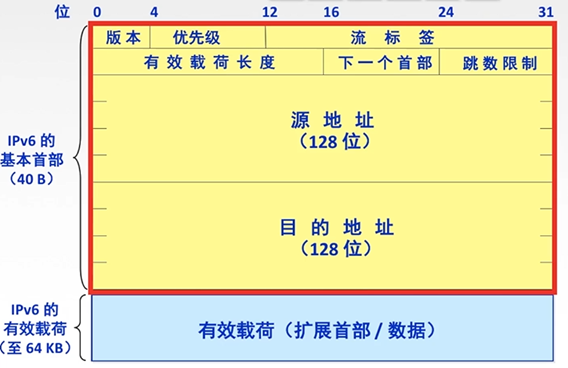
> 如上图所示，“版本”指明了协议版本，总是6。“优先级”区分数据报的类别和优先级。“流”是互联网络上从特定源点到特定终点的一系列数据报。所有属于同一个流的数据报都具有同样的“流标签”。“有效载荷长度”即扩展首部+数据的大小。“下一个首部”用于标识下一个扩展首部或上层协议首部。“跳数限制”相当于IPv4的TTL。

**IPv6和IPv4**
1. IPv6将地址从32位(4B)扩大到**128位(16B)**，更大的地址空间。
2. IPv6将IPv4的校验和字段彻底移除，以减少每跳的处理时间。
3. IPv6将IPv4的可选字段移出首部，变成了**扩展首部**，成为灵活的首部格式，里尤其通常不对扩展首部进行检查，大大提高了路由器的处理效率。
4. IPv6支持**即插即用**(即自动配置)，不需要DHCP协议。
5. IPv6首部必须是**8B的整数倍**，IPv4首部是4B的整数倍。
6. IPv6**只能在主机处分片**，IPv4可以在路由器和主机处分片。
7. ICMPv6：附加报文类型“分组过大”
8. IPv6支持自愿的预分配，支持实时影像等要求，保证一定的带宽和时延的应用。
9. IPv6取消了协议字段，改成下一个首部字段。
10. IPv6取消了总长度字段，改用有效载荷长度字段。
11. IPv6取消了服务类型字段。

**IPv6地址表示形式**
1. 一般形式：冒号十六进制记法：E.g. 4BF5:AA12:0216:FEBC:BA5F:039A:BE9A:2170
2. 压缩形式：
* E.g. 4BF5:0000:0000:0000:BA5F:039A:000A:2176
* 可被压缩为 4BF5:0:0:0:BA5F:39A:A:2176
* 零压缩：一连串连续的0可以被一对冒号取代。
* E.g. FF05:0:0:0:0:0:0:B3 $\rightarrow$ FF05::B3
* 注意：双冒号表示法在一个地址中仅可出现一次。

**IPv6基本地址类型**
* 单播：一对一通信 &emsp; 可做源地址+目的地址
* 多播： 一对多通信 &emsp; 可做目的地址
* 任播：一对多中的一个通信 &emsp; 可做目的地址

**IPv6向IPv4过渡的策略**
* 双栈协议：双协议栈技术就说指在一台设备上**同时启用IPv4协议栈和IPv6协议栈**。这样的话，这台设备既能和IPv4网络通信，又能和IPv6网络通信。如果这台设备是一个**路由器**，那么这台路由器的不同接口上，分别配置了IPv4地址和IPv6地址，并很可能分别连接了IPv4网络和IPv6网络。如果这台设备是一个**计算机**，那么它将同时拥有IPv4地址和IPv6地址，并具备同时处理这两个协议地址的功能。
* 隧道技术：通过使用互联网络的基础设施在网络之间传递数据的方式。使用隧道传递的数据（或负载）可以是不同协议的数据帧或包。隧道协议将其他协议的数据帧或包**重新封装**然后通过隧道发送。

**RIP协议和谁交换？多久交换一次？交换什么**
1. 仅和**相邻路由器**交换信息。
2. 路由器交换的信息是**自己的路由表**。
3. **每30秒**交换一次路由信息，然后路由器根据新信息更新路由表。若超过180秒没收到邻居路由器的通告，则判定邻居没了，并更新自己的路由表。
* 路由器刚开始工作时，只知道直接连接的网络的距离（距离为1），接着每一个路由器也只和数目非常有限的相邻路由器交换并更新路由信息。
* 经过若干次更新后，所有路由器最终队徽知道到达本自治系统任何一个网络的最短距离和下一跳路由器的地址，即“**收敛**”

**距离向量算法**
1. 修改相邻路由器发来的RIP报文中所有表项：
* 对地址为X的相邻路由器发来的RIP报文，修改此报文中的所有项目：把“下一跳”字段中的地址改为X，并把**所有的“距离”字段+1**。
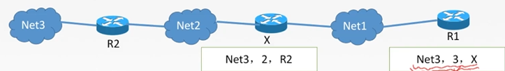
2. 对修改后的RIP报文中的每一个项目，进行以下步骤（图中为旧消息）：
* R1路由表中若没有Net3，则把该项目填入R1路由表。
* R1路由表中若有Net3，则查看下一跳路由器地址：
  * 若下一跳是X，则用收到的项目替换源路由表中的项目（为了以最新的消息为标准）；
  * 若下一跳不是X，原来距离比从X走的距离远则更新，否则不作处理。
3. 若180秒还没收到相邻路由表X的更新路由表，则把X记为不可达的路由器，即把距离设置为16。
4. 返回

**RIP协议的报文格式（无需记忆）**
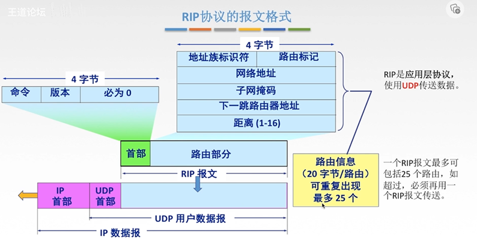

**OSPF协议**
* OSPF最主要的特征就是使用分布式的**链路状态协议**。
* OSPF的特点：
1. 和谁交换：使用洪泛法向自治系统内**所有路由器**发送信息，即路由器通过输出端口向所有相邻的路由器发送信息，而每一个相邻路由器又再次将此信息发往其所有的相邻路由器。（**广播**）$\rightarrow$ 最终整个区域内所有路由器都得到了这个信息的一个副本。
2. 交换什么：发送的信息就说与本路由器**相邻的所有路由器的链路状态**（本路由器和哪些路由器相邻，以及该链路的度量/代价--费用、距离、时延、带宽等）。
3. 多久交换：只有当**链路状态发生变化时**，路由器才向所有路由器洪泛发送此信息。
4. 最后，所有路由器都能建立一个**链路状态数据库**，即**全网拓扑图**。

**链路状态路由算法**
1. 每个路由器发现它的邻居结点[HELLO问候分组]，并了解邻居节点的网络地址。
2. 设置到它的每个邻居的成本度量metric。
3. 构造[DD数据库描述分组]，向邻站给出自己的链路状态数据库中的所有链路状态项目的摘要信息。
4. 如果DD分组中的摘要自己都有，则邻站不做处理: 如果有没有的或者是更新的，则发送[LSR链路状态请求分组]请求自己没有的和比自己更新的信息。
* 如果收到邻站的LSR分组后，发送[LSU链路状态更新分组]进行更新。更新完毕后，邻站返回一个[LSAck链路状态确认分组]进行确认。
* 如果只要一个路由器的链路状态发生变化:泛洪发送[LSU链路状态更新分组]进行更新。更新完毕后，其他站返回一个[LSAck链路状态确认分组]进行确认。
5. 使用Dijkstra根据自己的链路状态数据库构造到其他节点间的最短路径

**OSPF分组**

**OSPF其他特点**
1. 每隔30min，要刷新一次数据库中的链路状态。
2. 由于一个路由器的链路状态只涉及到与相邻路由器的连通状态，因而与整个互联网的规模并无直接关系。因此**当互联网规模很大时**，OSPF 协议要比距离向量协议 RIP 好得多
3. OSPF不存在坏消息传的慢的问题，它的**收敛速度很快**。

**BGP协议**
* 基本认识：
1. 和谁交换：与其他AS的邻站BGP发言人交换信息。
2. 交换什么：交换的网络可达性的信息，即要到达某个网络所要经过的一系列AS。
3. 多久交换：发生变化时更新有变化的部分。

**BGP协议报文格式**
* 一个BGP发言人与其他自治系统中的BGP发言人要交换路由信息，就要先**建立TCP链接**，即通过TCP传送，然后在此连接上交换BGP报文以建立BGP会话（session），利用BGP会话交换路由信息。
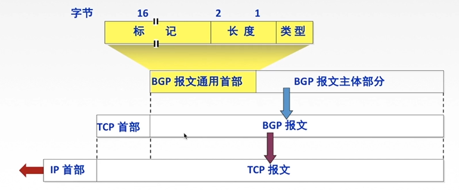

**BGP-4的四种报文**
1. OPEN(打开) 报文: 用来与相邻的另一个BGP发言人建立关系，并认证发送方。
2. UPDATE (更新)报文: 通告新路径或撤销原路径。
3. KEEPALIVE(保活)报文: 在无UPDATE时，周期性证实邻站的连通性:也作为OPEN的确认。
4. NOTIFICATION (通知) 报文:报告先前报文的差错:也被用于关闭连接。

**三种路由协议比较**
* RIP：是一种分布式的基于距离向量的内部网关路由选择协议，通过广播**UDP**报文来交换路由信息。
* OSPF：是一个内部网关协议，要交换的信息量较大，应使报文的长度尽量短，所以不使用传输层协议(如UDP或TCP)，而是直接采用**IP**。
* BGP：是一个外部网关协议，在不同的自治系统之间交换路由信息，由于网络环境复杂，需要保证可靠传输，所以采用**TCP**。
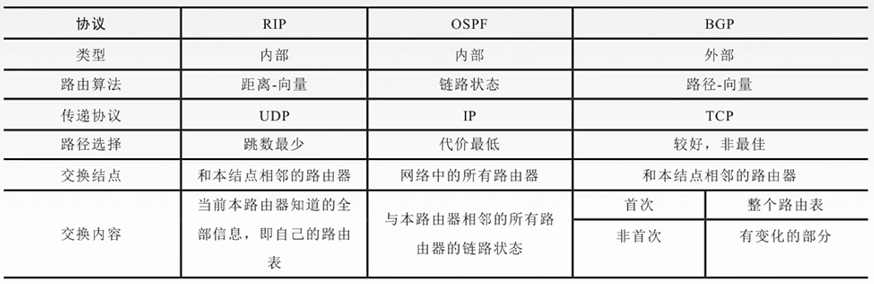

**IP数据报的三种传输方式**
* 单播：单播用于发送数据包到单个目的地，且每发送一份单播报文都使用一个单播IP地址作为目的地址。是一种点对点传输方式。
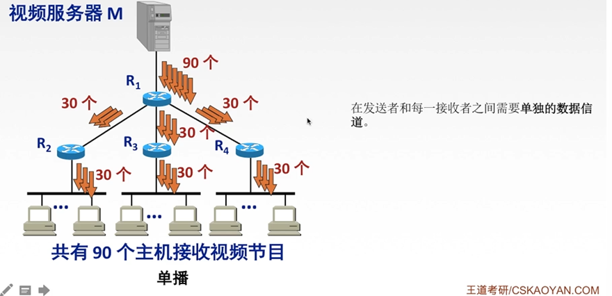
* 广播：广播是指发送数据包到同一广播域或子网内的所有设备的一种数据传输方式，是一种**点对多点**传输方式。
* 组播 (多播)：当网络中的某些用户需要特定数据时，组播数据发送者仅发送一次数据，借助组播路由协议为组播数据包建立组播分发树，被传递的数据到达距离用户端尽可能近的节点后才开始复制和分发，是一种点**对多点**传输方式。
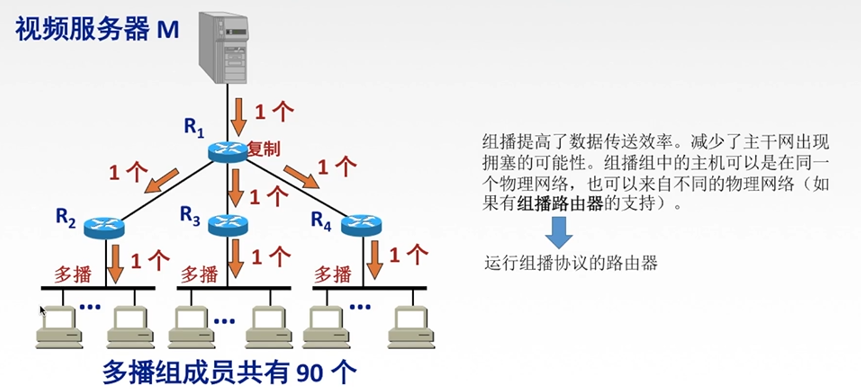

**硬件组播**
> 同单播地址一样，组播IP地址也需要相应的组播MAC地址在本地网络中实际传送帧。组播MAC地址以十六进制值01-00-5E打头，余下的6个十六进制位是根据IP组播组地址的最后23位转换得到的。
* TCP/IP 协议使用的以太网多播地址的范围是:从01-00-5E-00-00-00到01-00-5E-7F-FF-FF
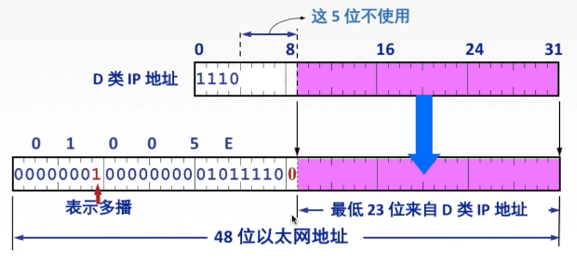
* 收到多播数据报的主机，还要在IP 层利用软件进行过滤，把不是本主机要接收的数据报丢弃。

**网际组管理协议IGMP**
> IGMP协议让路由器知道本局域网上**是否有主机（的进程）参加或退出了某个某个组播组**
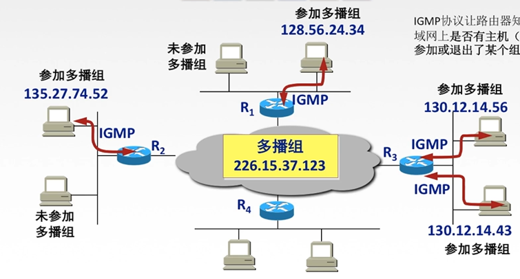
* 两个工作阶段：
1. 某主机要加入组播组时，该主机向组播组的组播地址发送一个IGMP报文，声明自己要称为该组的成员。本地组播路由器收到IGMP报文后，要利用组播路由选择协议把这组成员关系发给因特网上的其他组播路由器。
2. 本地组播路由器周期性探询本地局域网上的主机，以便知道这些主机是否还是组播组的成员。只要有一个主机对某个组响应，那么组播路由器就认为这个组是活跃的:如果经过几次探询后没有一个主机响应，组播路由器就认为本网络上的没有此组播组的主机，因此就不再把这组的成员关系发给其他的组播路由器。
* 组播路由器知道的成员关系只是所连接的局域网中有无组播组的成员。

**组播路由选择协议**
* 组播路由协议目的是找出以源主机为根节点的组播转发树。
* 构造树可以避免在路由器之间兜圈子。
* 对不同的多播组对应于不同的多播转发树:同一个多播组，对不同的源点也会有不同的多播转发树
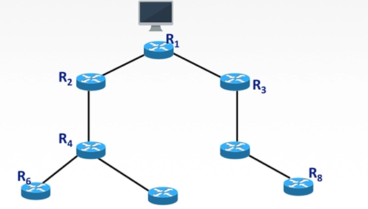

**移动IP相关概念**
> 移动IP技术是移动结点(计算机/服务器等)以固定的网络IP地址，实现跨越不同网段的漫游功能，并保证了基于网络IP的网络权限在漫游过程中不发生任何改变。
* 移动结点：具有永久IP地址的移动设备。
* 归属代理(本地代理)：一个移动结点的永久“居所”称为归属网络，在归属网络中代表移动节点执行移动管理功能的实体叫做归属代理。
* 永久地址 (归属地址/主地址)：移动站点在归属网络中的原始地址。
* 外部代理(外地代理)：在外部网络中帮助移动节点完成移动管理功能的实体称为外部代理
* 转交地址 (辅地址)：可以是外部代理的地址或动态配置的一个地址

**移动IP通信过程**
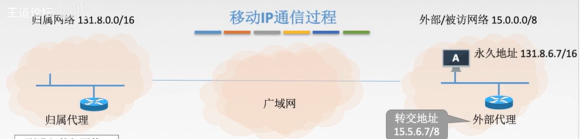
* A刚进入外部网络:
1. 获得外部代理的转交地址(外部代理广播报文)。
2. 移动节点通过外部代理发送注册报文给归属代理(包含永地址&转交地址)。
3. 归属代理接收请求，并将移动节点的永久地址和转交地址绑定(以后到达该归属代理的数据报且要发往移动节点的数据报将被封装并以隧道方式发给转交地址)，并返回一注册响应报文。
4. 外部代理接收注册响应，并转发给移动节点。
* A移动到了下一个网络:
1. 在新外部代理登记注册一个转交地址。
2. 新外部代理给本地代理发送新的转交地址(覆盖旧的)。
3. 通信
* A回到了归属网络:
1. A向本地代理注销转交地址。
2. 按原始方式通信。

**路由器**
> 路由器是一种具有多个输入端口和多个输出端口的专用计算机，其任务是转发分组。
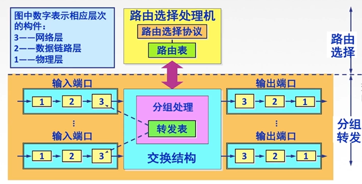
* 路由选择：根据所选定的路由选择协议构造出路由表，同时经常或定期地和相邻路由器交换路由信息而不断地更新和维护路由表。
* 分组转发：交换结构:根据转发表(路由表得来)对分组进行转发。若收到RIP/OSPF分组等，则把分组送往路由选择处理机:若收到数据分组，则查找转发表并输出。

**输出端口将交换结构传送来的分组发送到线路**
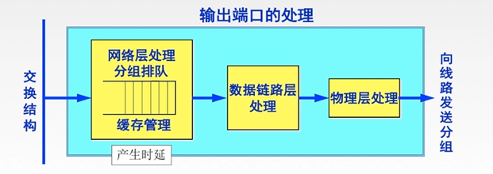
* 若路由器处理分组的速率赶不上分组进入队列的速率，则队列的存储空间最终必定减少到零，这就使后面再进入队列的分组由于没有存储空间而只能被丢弃。
* **路由器中的输入或输出队列产生溢出是造成分组丢失的重要原因。**

**三层设备的区别**
* 路由器：可以互联两个不同网络层协议的网段。
* 网桥：可以互联两个物理层和链路层不同的网段。
* 集线器：不能互联两个物理层不同的网段。
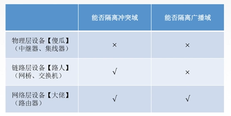

**路由表与路由转发**
* 路由表根据**路由选择算法**得出的，主要用途是路由选择，总用软件来实现。
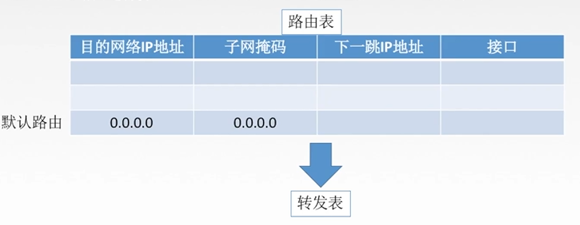
* 转发表由**路由表**得来，可以用软件实现，也可以用特殊的硬件来实现。转发表必须包含完成转发功能所必需的信息，在转发表的每一行必须包含从要到达的目的网络到输出端口和某些MAC地址信息的映射。

