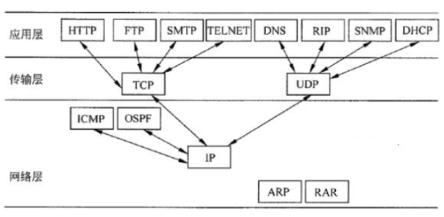
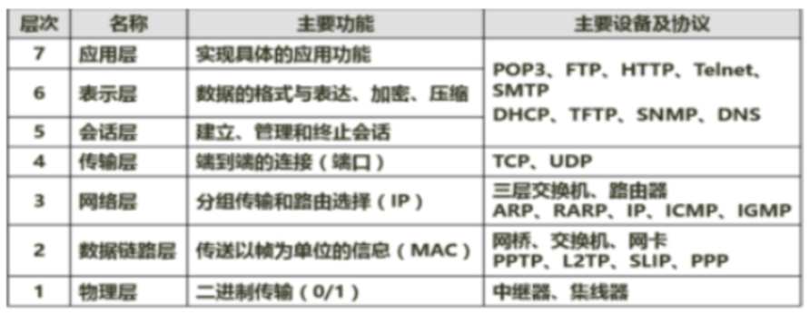
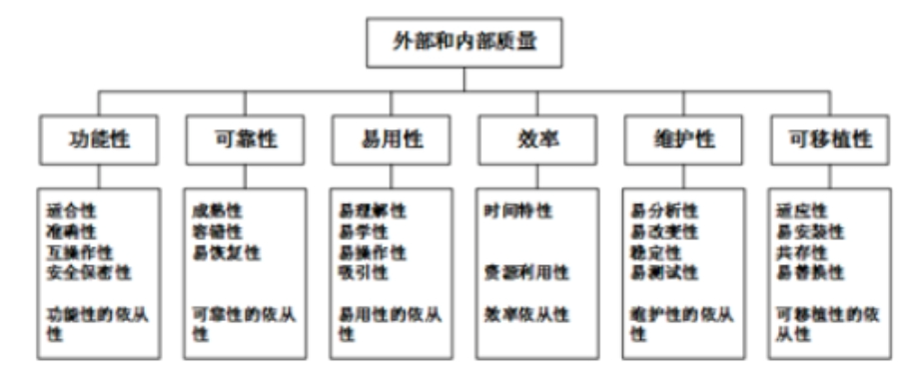

**层次化网络设计：**
**接入层**：用户接入 计费管理 MAC地址认证 收集用户信息
**汇聚层**：网络访问策略控制 数据包处理 过滤 寻址
**核心层**：高速数据交换 常用冗余机制

**冗余技术**：又称储备技术，是利用系统的并联模式来提高系统可靠性的一种手段。

**https**:用于在客户计算机和服务器之间交换信息，使用ssl进行信息交换。http端口80，https443

**DHCP**: 动态主机配置协议，通过服务器的IP地址数据库动态管理网络上的IP地址和其他相关配置，是BOOTP协议的扩充。客户端可从DHCP服务器获得本机IP地址，DNS服务器的地址，DHCP服务器的地址，默认网关的地址等，但没有web服务器，邮件服务器地址。

**BOOTP**:是基于UDP的协议，用于无盘工作站从服务器获得自己的IP地址，DHCP引入了租约概念。

**FTP**: 因特网上使用最广的文件传送协议，采用c/s工作模式，20为数据口，21为控制口

**ICMP**: TCP/IP协议族的一个子协议，属于网络层协议，用于在主机与路由器之间传递控制信息，包括报告错误，交换受限控制和状态信息等。ICMP，TCP，UDP ，IGMP使用IP数据包传送数据，因此不保证可靠传输。

**TCP/IP**: 协议栈的网络层主要协议是IP协议，同时还需辅助协议，如ICMP ARP RARP IGCMP等。UDP属于传输层协议

**POP3**：适用于c/s结构的脱机模型的电子邮件协议，默认服务端口号110
**SMTP**：简单邮件传输协议，端口号为25，用于控制信件的中转方式，属于TCP/IP协议簇，帮助每台计算机在发送或中转信件时找到下一个目的地。
**IMAP**：邮件获取协议
**MPLS**：即多协议标记交换，是一种标记机制的包交换技术

**ARP**：地址解析协议，网络层上的协议实现IP地址与MAC地址之间的交换

**Tenet**：端口号为23

**DNS**：端口号为53

**包过滤技术**：基于网络层 传输层的安全技术，优点：简单实用，实现成本低，对应用层透明。缺点：无法识别基于应用层的恶意入侵

**代理服务技术**：基于应用层，需要检查数据包的内容，优点：能够对基于高层协议的攻击进行拦截，安全性比包过滤好，缺点：处理速度慢，不适用于高速网之间的应用

**数字签名**采用私钥进行签名，公钥进行验证

**VPN**关键技术有隧道技术，加解密技术，密钥管理技术和身份认证技术。L2TP.PPTP是两种链路层的vpn协议，TSL是传输层vpn协议，IPsec是网络层vpn协议。

**两个证书发放机构互换公钥是a，b互信的必要条件**

**运行web浏览器的计算机与网页所在的计算机首先要建立TCP连接，采用http协议传输网页文件。**

安全哈希算法**SHA**主要适用于数字签名标准里面定义的数字签名算法，**SHA-I**会产生一个160位的消息摘要。当接收到消息的时候，这个消息摘要可以用于验证数据的完整性。

**SSH**建立在应用层基础上的安全协议，专为远程登陆会话和其他网络服务提供安全性的协议。利用SSH协议可以有效防止远程管理过程中的信息泄露问题。

**SNMP**：简单网络管理协议，支持网络管理系统，用于监测连接到网络上的设备是否有任何引起管理上关注的情况。

**各个协议所在层**

**软件测试的安全测试方法**: 安全性功能验证、漏洞扫描、模拟攻击试验、网络侦听，而通信加密是安全防护手段，不属于安全性测试方法

**报文摘要**: 保证报文的完整性，原报文只要有一位被改变，则摘要信息就不会匹配。用私钥对摘要做加密，不仅保证摘要的私密性，还可以防止抵赖，谁能用公钥解开报文，说明就是某人做的。

**网络建设**：包括网络需求分析、网络体系结构设计、网络安全性设计、设备造型等阶段。

**网络设备工作层次**：
**中继器**：物理层，对接收信号进行再生和发送，只起到扩展传输距离的作用。
**网桥**：数据链路层，根据帧物理地址进行网络之间的信息转发。可缓解网络通信繁忙度，但只能连接相同MAC层的网络。
**路由器**：网络层，通过逻辑地址进行网络之间的信息转发，可完成异构网络之间的互联互通，只能连接使用相同网络层协议的子网。
**网关**：高层（第4-7层），最复杂的网络互联设备，用于连接网络层以上执行不同协议的子网。
**集线器**：物理层，多端口中继器。
**二层交换机**：数据链路层，是指传统意义上的交换机，多端口网桥
**三层交换机**：网络层，带路由功能的二层交换机。
**多层交换机**：高层（第4-7层），带协议转换的交换机。

**DMZ**：为了解决安装防火墙后外部网络不能访问内部网络服务器的问题，而设立的一个非安全系统与安全系统之间的缓冲区，即内网与外网之间的小网络区域，可以部署企业web服务器，FTP服务器和论坛等。

**静态路由**：用户或网络管理员手工配置的路由信息。
**随机路由**：使用前向代理来收集网络中的有限全局信息即当前结点到其源节点的旅行时间，并以此来更新结点的旅行时间表。
**洪泛路由**：简单的路由算法，将收到的封包，往所有的可能连接路径上递送，直到封包到达为止。
**动态路由**：自适应路由选择算法，是指路由器能够自动地建立自己的路由表，并且能够根据实际情况的变化适时地进行调整。

**各层功能及设备协议**

**安全服务**：包括认证、数据保密性、数据完整性、抗抵赖性、访问控制
**安全机制**：包括加密机制、数字签名机制、访问控制机制、数据完整性机制、认证机制、通信业务填充机制、路由控制机制、公证机制

**MIME**：多用途互联网邮件扩展类型
**S/MIME**:是对MIME在安全方面的扩展，它可以把MIME实体封装成安全对象，还可以用于提供数据保密、完整性保护、认证和鉴定服务等功能。但其只保护邮件的邮件主体，对头部信息则不进行加密，以便让邮件成功地在发送者和接收者的网关之间传递。

**感觉媒体**：视觉，听觉，嗅觉等
**表示媒体**：语言编码，电报码，条形码，图片，动画。
**表现（显示）媒体**：输入输出设备，包括显示器，键盘等。
**传输媒体**：光缆，电缆，交换设备等。

机器字长为n位的二进制数可以用补码来表示$2^n$个不同的符号定点小数

**系统初始化过程**：可分为3个主要环节，按照自底向上、从硬件到软件的次序依次为：片级初始化、板级初始化、系统级初始化。

**瀑布模型**：给出了软件生成周期各阶段的固定顺序，上一阶段完成后才能进入下一阶段。
**演化模型**：在快速开发一个原型的基础上，根据用户在试用原型的过程中提出的反馈意见和建议，对原型进行改进，获得原型的新版本。重复这一过程，直到演化成最终的软件产品。
**螺旋模型**：将瀑布模型和演化模型相结合，并增加了风险分析。它以原型为基础，沿着螺线自内向外旋转，每旋转一圈都要经过制订计划、风险分析、实施工程、客户评价等活动，并开发原型的一个新版本。经过若干次螺旋上升的过程，得到最终的软件。
**喷泉模型**：主要用来描述面向对象的开发过程。体现了面向对象开发过程的迭代和无间隙特征。迭代意味着模型中的开发活动常常需要多次重复；无间隙是指开发活动（如分析、设计）之间不存在明显的边界，各项开发活动往往交叉迭代地进行。

**QFD(质量功能展开)**: 3类需求，基本需求（常规需求），期望需求和意外需求（兴奋需求）

**组合结构图**：描述结构化类（例如，构建或类）的内部结构，包括结构化类与系统其余部分的交互点。组合结构图用于画出结构化类的内部内容。

**定时图**：也称计时图，定时图也是一种交互图，它强调消息跨越不同对象，而不仅仅是关心消息的相对顺序。

**制品图**：描述计算机中一个系统的物理结构。制品包括文件、数据库和类似的物理比特集合。通常与部署图一起使用

**交互概览图**：活动图和顺序图的混合物。

**部署图(配置图)**：是用来显示系统中软件和硬件的物理架构。从部署图中可以了解到软件和硬件组件之间的物理关系以及处理节点的组件分布情况。

**时间管理的过程**：包括活动定义、活动排序、活动的资源估算、活动历时估算制定计划进度控制。

**甘特图**：优点：可以清晰地描述每个任务之间的并行性。缺点：不能清晰地反映出任务之间的依赖关系，难以确定整个项目的关键所在，也不能反映计划中有潜力的部分。
**PERT图**：不仅给出了每个任务的开始时间、结束时间和完成该任务所需的时间，还给出了任务之间的关系，但PERT图无法清晰地描述各个任务之间的并行关系。

**测试用例**：将软件测试的行为活动做一个科学化的组织归纳，来源可以是需求规格说明书、源程序、设计说明书（概要设计、详细设计）等一系列相关文档。

**项目开发计划**：主要描述项目开发背景、必要性、人员、项目开发内容、技术路线、关键性与先进性、时间节点安排、风险分析等项目管理等方面的事情，其中没有可以被测试案例使用的内容。

**白盒测试**：方法包括静态测试、动态测试。
**静态测试**：包括代码检查法、静态结构分析法、静态质量度量法，其不会实际运行代码，而运行代码的就是动态测试。

在**需求管理过程中需求的变更**是受严格管控的，其流程为：问题分析和变更描述、变更分析和成本计算、变更实现。

**XP(极限编程)**：是一种轻量级(敏捷)、高效、低风险、柔性、可预测的、科学的软件开发方式。它由价值观、原则、实践和行为四个部分组成，彼此依赖、关联，并通过行为贯穿于整个生存周期。其四大价值观包括沟通、简单、反馈和勇气。

**需求工程活动**产生软件运行特征的规约，指明软件和其他系统元素的接口并建立软件必须满足的约束条件。数据流图和数据字典只是这些约束条件的表示方法，而程序流程图和体系结构模型是设计阶段的工作。

**单元测试**：通常在模块的开发期间实施，主要测试程序中的一个模块或一个子程序。
**集成测试**：通常需要将所有程序模块按照设计要求组装成为系统，这种测试的目的是保证各模块能够正常运行的同时，组装后的系统也能达到预期
**结构测试**：在了解程序结构的前提下在单元/模块测试中进行。
**可靠性测试**：主要检查软件的平均失效间隔时间等指标是否符合系统需求。
**确认测试**：包括内部确认测试以及Alpha测试与Beta测试。

**代码审查**：以人工的模拟技术和一些与动态分析类似的方法对于程序进行分析和测试，通常在单元测试阶段进行。
**设计评审**：指对软件需求分析阶段和概要设计阶段产生的软件设计说明书进行质量等方面的评审，此时软件还没有形成实体。

**偶然聚合（内聚）**：模块完成的动作之间没有任何关系，或者仅仅一种非常松散的关系。
**逻辑聚合（内聚）**：模块内部的各个组成在逻辑上具有相似的处理动作，但功能用途上彼此无关。
**时间聚合（瞬时内聚）**：模块内部的各个组成部分所包含的处理动作必须在同一时间内执行。
**过程聚合（内聚）**：模块内部各个组成部分所要完成的动作虽然没有关系，但必须按照特定的次序执行。
**通信聚合（内聚）**：模块各个组成部分所完成的动作都使用了同一个数据或产生同一输出数据。
**顺序聚合（内聚）**：模块内部的各个部分，前一部分处理动作的最后输出是后一部分处理动作的输入。
**功能聚合（内聚）**：模块内部各个部分全部属于一个整体，并执行同一功能，且各部分对是实现该功能都必不可少。

**配置项**：是构成产品配置的主要元素，配置项主要有以下两类：1. 属于产品组成部分的工作成果：如需求文档，设计文档，源代码，测试用例等 2. 属于项目管理和机构支撑过程域产生的文档：如工作计划、项目质量报告、项目跟踪报告等。

**XP极限编程**：高效、低风险、测试先行（先写测试代码，再编写程序）代码所有权归整个团队
**Cockburn水晶方法**：不同项目，不同策略。
**SCRUM并列争求法**：迭代。30天为一个迭代周期，按照需求优先级实现。
**FDD功用驱动方法**：开发人员分类，分为指挥者（首席程序员）、类程序员。
**开放式源码**：虚拟团队，开发成员分布各地。
**ASD自适应方法**：预测-协作-学习。

**验证**注重过程，**确认**注重结果。

**项目管理工具**：用于辅助软件的项目管理活动，包括项目的计划、调度、通信、成本估算、资源分配及质量控制等。其具有以下特征：覆盖整个软件生存周期、为项目调度提供多种有效手段、利用估算模型对软件费用和工作量进行估算、支持多个项目和子项目的管理、确定关键路径，松弛时间，超前时间和滞后时间、对项目组成员和项目任务之间的通信给予辅导、自动进行资源平衡、跟踪资源的使用、生成固定格式的报表和裁剪项目报告。成本估算工具就是一种典型的项目管理工具。

**软件过程**：是制作软件产品的一组活动以及结果，软件活动包括：软件描述、软件开发、软件有效性验证、软件进化。

**COCOMO**：
**基本模型**：是一个静态单变量模型，用一个已估算出来的源代码行数（LOC）为自变量的函数来计算软件开发工作量。
**中级模型**：基本模型的基础上，再涉及产品、硬件、人员、项目等方面属性的影响因素来调整工作量的估算。
**详细模型**：中级模型的基础上，考虑对软件工程过程中分析、设计等各步骤的影响。

**COCOMO II**是一种成本估算模型，估算选择有：对象点、功能点、代码行。

**退化测试**：软件修改后进行的测试，包括1. 插入新的代码，程序成为新版本。2. 测试可能受新代码影响的功能。3. 测试修改前的基本功能。4. 测试新版本的功能。

**软件质量保证**：不对软件进行剖析，找出问题或进行评估，不负责生成高质量软件产品和制定质量计划。

**范围定义**的输入包括项目章程、项目范围管理计划、组织过程资产、批准的变更申请。

**数据库的设计过程**：需求分析、概念结构设计（ER图）、逻辑结构设计（将ER图转换成表）、数据库物理设计、数据库的实施、数据库运行和维护。

**统一过程(UP)**：用例和风险驱动，以架构为中心，受控的迭代式增量开发。UP定义的四阶段：起始阶段，精化阶段，构建阶段，移交阶段。

**仓库风格**：优点：解决问题的多方法性，具有可更改性和可维护性，有可重用的知识源，支持容错性和健壮性。缺点：测试困难，不能保证有好的求解方案，效率低，开发成本高，缺少对并行机的支持。仓库风格包括：数据库系统，黑板系统，超文本系统。

**管道/过滤器体系结构**：优点：高内聚低耦合，分而治之，支持软件重用，维护简单，支持并行。

**软件质量**包括：内部质量，外部质量，使用质量。
**软件质量模型**的三个层次：质量特性，质量子特性，度量指标。

**水平原型**用于探索预期系统的一些特定行文，**垂直（结构化）原型**则实现了一部分功能。抛弃式原型用于探索，演化式原型用于逐步演化为最终系统。

**沟通渠道** = N(N-1)/2

**事物**具有原子性，一致性，隔离性和持久性。

**加密技术中对称性加密技术的算法效率高**：DES、3DES、AES、Blowfish、IDEA、RC5、RC6

**功能性**度量：适合性、准确性、互操作性、保密安全性、功能依从性、**但不包括易用性**

**风险曝光度**=风险损失*风险概率

**CMMI**:CL0 未完成的，CL1 已执行的，CL2 已管理的，CL3已定义的，CL4 定量管理的，CL5 优化的

**外部和内部质量**：

**原型法**适合需求不清晰且多变的情况；**结构化开发方法**适用于系统规模不大且不太复杂，需求变化也不大的情况，基本特征为：自顶向下，逐层分解，也适合大型数据处理系统。**Jackson**是一种面向数据结构的方法，以数据结构为驱动，适合于小规模的项目。

**公共耦合**：指通过一个公共数据相互作用的那些模块间的耦合。
**控制耦合**：如果一个模块通过传送开关、标志、名字等控制信息，明显地控制选择另一模块的功能，就是控制耦合。
**标记耦合**：一组模块通过参数表传递记录信息，就是标记耦合。
**数据耦合**：一个模块访问另一个模块时，彼此之间是通过简单数据参数来交换输入输出信息的。

**需求分析阶段**：需输出确定数据流图，实体联系图，数据字典。

**MTBF**，平均故障间隔时间（平均无故障时间）

**UML构件图**专注于系统的静态实现图

